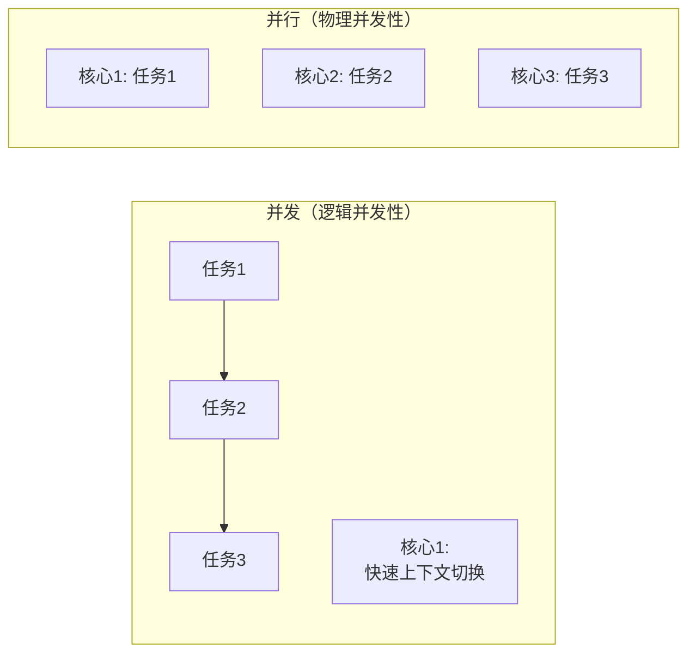
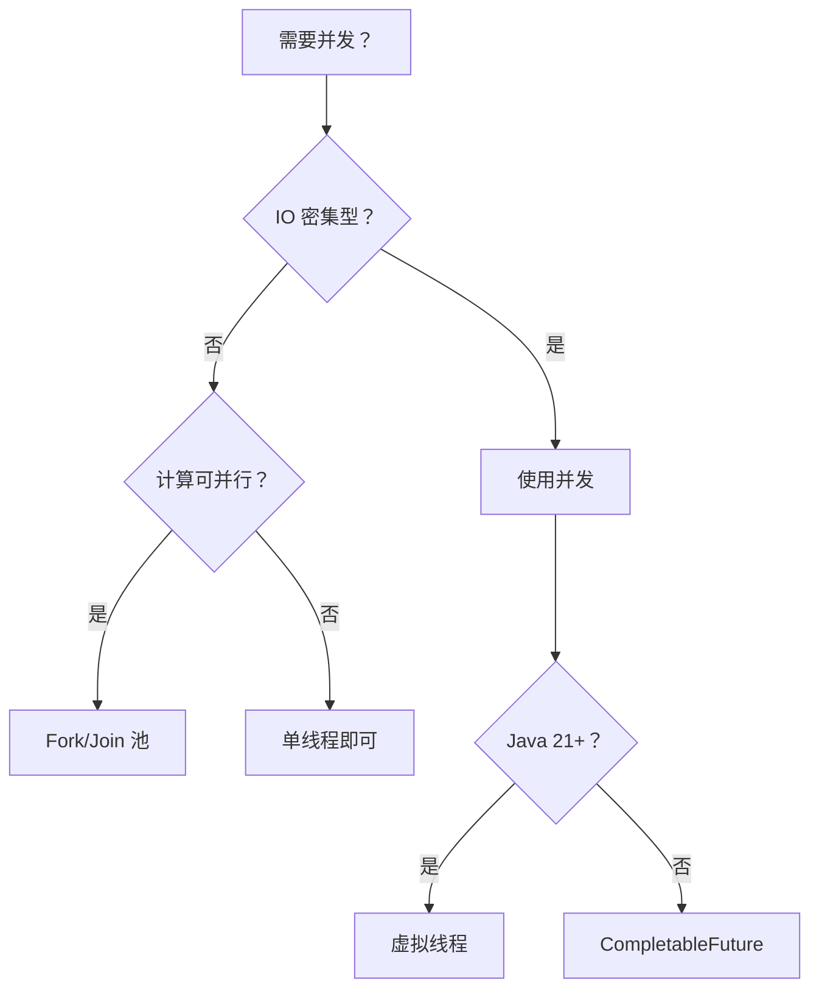
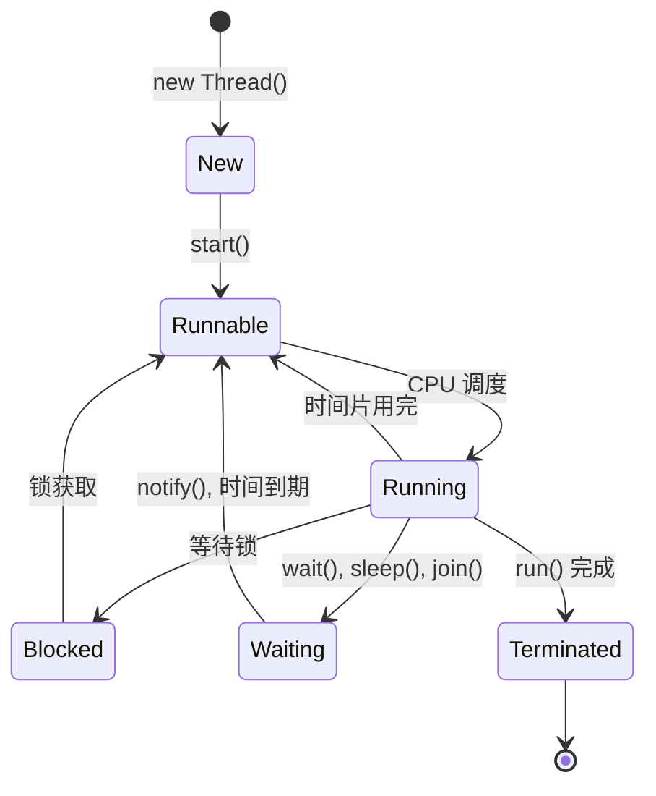
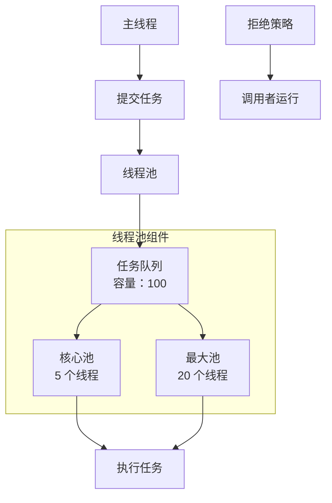
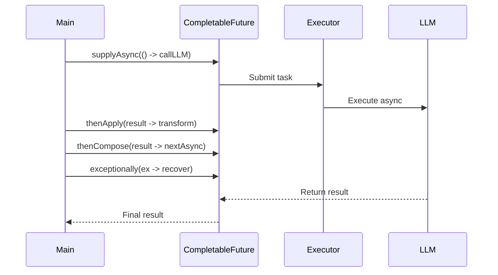
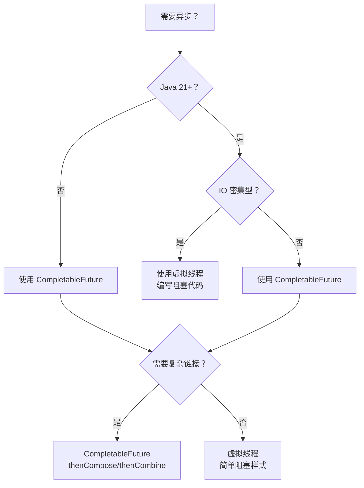
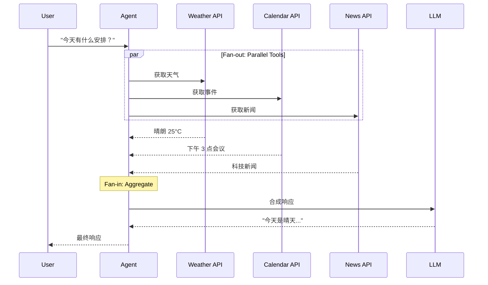
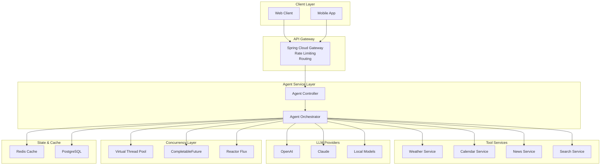

# ⚡ Java 并发编程

> **"并发（Concurrency）是同时处理很多事情，并行（Parallelism）是同时做很多事情。"**
> — Rob Pike

在 AI Agent 时代，并发编程不仅仅是性能优化技术——它是构建响应式、可扩展系统的基础。本指南涵盖从基本概念到 Java 21+ 虚拟线程以及在智能体开发中的应用的所有内容。

---

## 第1部分：核心概念与"为什么"

### 1.1 什么是并发？

理解并发与并行之间的基本区别对于设计高效系统至关重要。虽然这两个词经常互换使用，但它们代表了处理多个任务的不同方法，并对系统架构和性能有不同影响。

**并发 vs 并行**



**并发（Concurrency）**是通过在单个核心上快速切换来处理多个任务，使程序能够同时处理很多事情。

**并行（Parallelism）**是在多个核心上真正同时执行多个任务，是同时做很多事情。

```java
// 并发：一个线程处理多个任务
// 时间切片：操作系统在任务间切换如此之快
// 使它们看起来像是同时运行的

// 并行：多个线程在多个 CPU 核心上
// 真正同时执行任务
```

### 1.2 为什么需要并发？

现代软件系统面临一个基本挑战：CPU 性能增益已从更快的单核转向了更多的核心数量。结合大多数操作（尤其是在 AI 系统中）是 IO 密集型而非 CPU 密集型的现实，并发不仅仅是优化技术，更是构建响应式、可扩展应用的必要条件。

#### 摩尔定律已死

单核 CPU 频率已达到物理极限。行业已从：
- **旧时代**：更快的单核（3GHz → 4GHz → 5GHz）
- **新时代**：更多核心（2 核心 → 8 核心 → 128 核心）

为了利用现代硬件，我们必须编写并发代码。

#### IO 密集型 vs CPU 密集型工作

| 特性 | IO 密集型 | CPU 密集型 |
|------|-----------|-----------|
| 瓶颈 | 等待外部资源 | CPU 计算 |
| 示例 | 数据库查询、API 调用、文件操作 | 图像处理、加密、计算 |
| AI Agent 上下文 | **LLM API 调用（500ms-2s）** | 分词、嵌入生成 |
| 解决方案 | 并发（隐藏延迟） | 并行（分布式工作） |

**AI Agent 现实**

当你的 Agent 调用 LLM API 时：
- 网络延迟：~100-500ms
- LLM 推理时间：~500ms-2s
- 你的 CPU 实际工作时间：~1-5ms

没有并发性，你的 CPU 99% 的时间都在**等待**（空闲）。

#### 性能影响

| 场景 | 串行时间 | 并发时间 | 加速比 |
|------|----------|----------|--------|
| 3 个 LLM 调用（每个 1.5s） | 4.5s | 1.5s | **3x** |
| 文档 + 图像生成 | 3s | 1.5s | **2x** |
| 批量 100 个请求 | 100s | 10s | **10x** |

```java
// ❌ 串行：总共 4.5 秒
String weather = llmClient.call("weather API");    // 1.5s
String news = llmClient.call("news API");          // 1.5s
String calendar = llmClient.call("calendar API");  // 1.5s

// ✅ 并发：总共 1.5 秒
CompletableFuture<String> weather = asyncCall("weather API");
CompletableFuture<String> news = asyncCall("news API");
CompletableFuture<String> calendar = asyncCall("calendar API");
CompletableFuture.allOf(weather, news, calendar).join();
```

### 1.3 权衡

并发是一个强大的工具，但它伴随着显著的成本。理解这些权衡有助于你做出明智的决定，关于何时以及如何应用并发编程技术。关键是要认识到并发引入的复杂性可能会使其弊大于利，如果应用不谨慎的话。

#### 优势
- **更高的吞吐量**：每秒处理更多请求
- **更好的响应性**：在等待时不会阻塞
- **资源利用率**：在 IO 等待时保持 CPU 忙碌

#### 成本
- **复杂性爆炸**：死锁、竞态条件、微妙的错误
- **调试困难**：问题是不可确定的，难以重现
- **上下文切换开销**：每次切换约 1-10 微秒

#### 决策树



---

## 第2部分：Java 并发基础

### 2.1 线程基础

线程是 Java 并发的基本单位。了解线程如何工作、它们的生命周期状态以及实现 `Runnable` 与扩展 `Thread` 之间的区别，对于任何使用并发系统的 Java 开发者来说都是必备知识。

#### Thread vs Runnable

**为什么实现 Runnable 而不是扩展 Thread？**

```java
// ❌ 坏方法：扩展 Thread
public class MyWorker extends Thread {
    @Override
    public void run() {
        // 工作逻辑
    }
}

// 问题：
// 1. Java 不支持多重继承
// 2. 与 Thread 实现紧密耦合
// 3. 难以与 ExecutorService 重用
```

```java
// ✅ 好方法：实现 Runnable
public class MyWorker implements Runnable {
    @Override
    public void run() {
        // 工作逻辑
    }
}

// 优势：
// 1. 可以扩展另一个类
// 2. 与 Thread 实现解耦
// 3. 与 ExecutorService 无缝工作

ExecutorService executor = Executors.newFixedThreadPool(10);
executor.submit(new MyWorker());
```

#### 线程生命周期



**关键状态**：
- **NEW**：线程已创建但未启动
- **RUNNABLE**：准备运行（正在运行或等待 CPU）
- **BLOCKED**：等待监视器锁
- **WAITING**：无限等待（wait(), join(), park()）
- **TIMED_WAITING**：带超时的等待（sleep(), wait(timeout)）
- **TERMINATED**：执行完成

### 2.2 线程安全与锁

当多个线程访问共享可变状态时，竞态条件和数据损坏成为严重风险。线程安全确保你的代码在多个线程同时执行时行为正确。本节介绍 Java 的三种主要同步机制，每种都有不同的权衡和用例。

#### 竞态条件：银行转账问题

```java
// ❌ 危险：竞态条件
public class BankAccount {
    private int balance = 1000;

    public void transfer(int amount) {
        // 检查：线程 A 读取余额 = 1000
        if (balance >= amount) {
            // 在这里发生上下文切换！
            // 线程 B 也读取余额 = 1000
            // 两个线程都认为可以转账

            // 执行：线程 A 扣除 600 → 余额 = 400
            balance = balance - amount;

            // 线程 B 也扣除 600 → 余额 = -200！
            // 账户透支！
        }
    }
}
```

**三种同步机制**

##### 1. `synchronized`（隐式锁）

```java
// ✅ 修复 1：同步方法
public class BankAccount {
    private int balance = 1000;

    // 内部锁（监视器）
    public synchronized void transferSafe(int amount) {
        if (balance >= amount) {
            balance = balance - amount;
        }
    }

    // 等价于：
    public void transferSafeEquivalent(int amount) {
        synchronized(this) {  // 在 "this" 实例上锁定
            if (balance >= amount) {
                balance = balance - amount;
            }
        }
    }
}
```

**优势**：简单，JVM 自动处理锁定/解锁
**劣势**：无公平性保证，无超时支持

##### 2. `ReentrantLock`（显式锁）

```java
// ✅ 修复 2：ReentrantLock
import java.util.concurrent.locks.ReentrantLock;
import java.util.concurrent.locks.Condition;

public class BankAccount {
    private int balance = 1000;
    private final ReentrantLock lock = new ReentrantLock();

    public void transferWithLock(int amount) {
        lock.lock();  // 必须显式获取
        try {
            if (balance >= amount) {
                balance = balance - amount;
            }
        } finally {
            lock.unlock();  // 必须在 finally 中释放
        }
    }

    // 高级：带超时的尝试
    public boolean transferWithTimeout(int amount, long timeoutMs)
            throws InterruptedException {
        if (lock.tryLock(timeoutMs, TimeUnit.MILLISECONDS)) {
            try {
                if (balance >= amount) {
                    balance = balance - amount;
                    return true;
                }
                return false;
            } finally {
                lock.unlock();
            }
        }
        return false;  // 无法获取锁
    }
}
```

**优势**：尝试锁、超时支持、公平锁选项、可中断
**劣势**：必须手动解锁（忘记 = 死锁风险）

##### 3. CAS - 无锁编程

```java
// ✅ 修复 3：AtomicInteger（比较并交换）
import java.util.concurrent.atomic.AtomicInteger;

public class BankAccount {
    private final AtomicInteger balance = new AtomicInteger(1000);

    public void transferAtomic(int amount) {
        balance.updateAndGet(current -> {
            // 原子操作：读-改-写
            return current >= amount ? current - amount : current;
        });
    }

    // 或使用 compareAndSet 进行更精细的控制
    public boolean transferCAS(int amount) {
        int current, newValue;
        do {
            current = balance.get();
            if (current < amount) {
                return false;  // 余额不足
            }
            newValue = current - amount;
            // CAS：如果内存仍然是 'current'，则设置为 'newValue'
            // 如果其他线程更改了它，则重试
        } while (!balance.compareAndSet(current, newValue));

        return true;
    }
}
```

**CAS 工作原理**：
1. 读取当前值
2. 计算新值
3. 原子检查：如果内存中仍然是当前值，则更新为新值
4. 如果检查失败，重试（循环）

**优势**：无锁争用，无死锁风险
**劣势**：CPU 忙等待，仅适用于简单操作

#### 锁机制比较

| 锁类型 | 性能 | 公平性 | 可中断 | 超时 | 最佳使用场景 |
|--------|------|--------|--------|------|--------------|
| `synchronized` | 高（JVM 优化） | 非公平 | 否 | 否 | 简单同步 |
| `ReentrantLock` | 中等 | 可配置 | 是 | 是 | 复杂控制逻辑 |
| `StampedLock` | 非常高 | 非公平 | 否 | 否 | 读密集型工作负载 |
| `Semaphore` | 中等 | 可配置 | 是 | 是 | 速率限制 |

### 2.3 线程池 - 工程关键

手动创建线程效率低下且不可扩展。线程池重用线程、控制并发性并提供更好的资源管理。掌握 `ThreadPoolExecutor` 配置对于构建生产就绪系统至关重要，尤其是在处理高容量 AI Agent 操作时。

#### 为什么不用 `new Thread()`？

```java
// ❌ 坏方法：手动创建线程
for (int i = 0; i < 10000; i++) {
    new Thread(() -> {
        callLLM();
    }).start();
}

// 问题：
// 1. 每个线程 = ~1MB 内存
// 2. 10,000 个线程 = ~10GB 内存！
// 3. 线程创建/销毁很昂贵
// 4. 无法控制并发性
```

#### ExecutorService 架构



#### ThreadPoolExecutor - 7 个核心参数

```java
public ThreadPoolExecutor(
    int corePoolSize,              // 1. 始终存活的线程
    int maximumPoolSize,            // 2. 包括核心在内的最大线程数
    long keepAliveTime,             // 3. 空闲线程生存时间
    TimeUnit unit,                  // 4. 时间单位
    BlockingQueue<Runnable> workQueue,  // 5. 任务等待队列
    ThreadFactory threadFactory,    // 6. 自定义线程创建器
    RejectedExecutionHandler handler    // 7. 满时做什么
)
```

**参数行为**：

| 任务数量 | 活动线程 | 队列行为 |
|----------|----------|----------|
| < corePoolSize | 创建到 corePoolSize | 队列为空 |
| = corePoolSize | corePoolSize 个线程 | 填充队列 |
| 队列满 | 创建到 maxPoolSize | 队列已满 |
| = maxPoolSize + 队列满 | **拒绝** | 触发处理器 |

#### 最佳实践 - 三个级别

##### 级别 1：✅ 自定义 ThreadPoolExecutor

```java
import com.google.common.util.concurrent.ThreadFactoryBuilder;

ThreadPoolExecutor executor = new ThreadPoolExecutor(
    5,                                  // corePoolSize: 始终运行
    20,                                 // maxPoolSize: 突发容量
    60L, TimeUnit.SECONDS,              // keepAliveTime: 回收空闲
    new LinkedBlockingQueue<>(100),     // workQueue: 有界队列
    new ThreadFactoryBuilder()          // threadFactory: 命名线程
        .setNameFormat("agent-pool-%d")
        .setDaemon(false)
        .build(),
    new ThreadPoolExecutor.CallerRunsPolicy()  // handler: 反压
);

// 监控
executor.prestartAllCoreThreads();  // 预热
log.info("Pool: active={}, core={}, max={}, queue={}",
    executor.getActiveCount(),
    executor.getCorePoolSize(),
    executor.getMaximumPoolSize(),
    executor.getQueue().size()
);
```

##### 级别 2：✅✅ Spring 配置

```java
@Configuration
public class ThreadPoolConfig {

    @Bean
    public ExecutorService agentTaskExecutor() {
        return new ThreadPoolExecutor(
            5, 20, 60, TimeUnit.SECONDS,
            new LinkedBlockingQueue<>(100),
            new ThreadFactoryBuilder()
                .setNameFormat("agent-task-%d")
                .build(),
            new ThreadPoolExecutor.CallerRunsPolicy()
        );
    }
}

@Service
public class AgentService {
    private final ExecutorService executor;

    public AgentService(ExecutorService agentTaskExecutor) {
        this.executor = agentTaskExecutor;
    }

    public CompletableFuture<String> executeAgent(String query) {
        return CompletableFuture.supplyAsync(
            () -> llmClient.call(query),
            executor  // 使用配置的池
        );
    }
}
```

##### 级别 3：✅✅✅ Spring @Async 与虚拟线程

```java
@Configuration
@EnableAsync
public class AsyncConfig {

    @Bean(name = "agentExecutor")
    public Executor agentExecutor() {
        ThreadPoolTaskExecutor executor = new ThreadPoolTaskExecutor();

        // 传统设置
        executor.setCorePoolSize(5);
        executor.setMaxPoolSize(20);
        executor.setQueueCapacity(100);
        executor.setThreadNamePrefix("agent-async-");
        executor.setRejectedExecutionHandler(
            new ThreadPoolExecutor.CallerRunsPolicy()
        );

        // Java 21+：使用虚拟线程！
        executor.setVirtualThreads(true);  // Spring Boot 3.2+

        executor.initialize();
        return executor;
    }
}

@Service
public class AgentService {

    @Async("agentExecutor")
    public CompletableFuture<String> executeAsync(String query) {
        // 在虚拟线程池中运行
        String result = llmClient.call(query);
        return CompletableFuture.completedFuture(result);
    }
}
```

#### 拒绝策略

| 策略 | 行为 | 用途 |
|------|------|------|
| **AbortPolicy**（默认） | 抛出异常 | 严格的业务，无数据丢失 |
| **CallerRunsPolicy** | 调用者执行 | 反压，优雅降级 |
| **DiscardPolicy** | 静默丢弃 | 可接受的数据丢失 |
| **DiscardOldestPolicy** | 丢弃最旧任务 | 过时数据价值低 |

```java
// CallerRunsPolicy 示例：
// 当池满时，@Controller 线程执行任务
// 这减慢了请求接受速度（反压）
// 防止系统过载
```

---

## 第3部分：现代异步编程

### 3.1 Future 及其局限性

Java 原始的 `Future` 接口用于表示异步计算结果，但它有显著的局限性，使其不足以处理复杂的异步工作流程。理解这些局限性是理解为什么需要 `CompletableFuture` 和其他现代异步构造的关键。

#### 原始的 `Future` 接口

```java
Future<String> future = executor.submit(() -> callLLM("prompt"));

try {
    // 阻塞的 get() - 违背异步目的
    String result = future.get();  // 无限等待
    String result = future.get(2, TimeUnit.SECONDS);  // 带超时等待

    // 检查状态
    if (future.isDone()) {
        // 任务完成
    }
    if (future.isCancelled()) {
        // 任务被取消
    }

    // 取消任务
    future.cancel(true);  // true = 如果正在运行则中断
} catch (InterruptedException e) {
    Thread.currentThread().interrupt();
} catch (ExecutionException e) {
    // 任务抛出异常
} catch (TimeoutException e) {
    // 任务耗时太长
}
```

#### 局限性

```java
// ❌ 问题 1：阻塞
CompletableFuture<String> future = asyncCall();
String result = future.get();  // 阻塞！无法做其他事情

// ❌ 问题 2：无法链接
Future<String> f1 = executor.submit(task1);
Future<String> f2 = executor.submit(task2);
// 如何组合结果？没有简单的方法！

// ❌ 问题 3：回调地狱
void asyncWithCallback() {
    executor.submit(() -> {
        String r1 = callLLM("step 1");
        executor.submit(() -> {
            String r2 = callLLM("step 2: " + r1);
            executor.submit(() -> {
                String r3 = callLLM("step 3: " + r2);
                // 嵌套回调...
            });
        });
    });
}
```

### 3.2 CompletableFuture - 异步组合

`CompletableFuture` 在 Java 8 中引入，通过支持可组合、可链接的异步操作彻底改变了异步编程。它提供了丰富的 API 来转换、组合和处理异步工作流中的错误，对于编排多个 AI Agent 工具调用和 LLM 交互尤其强大。

#### 核心 API 概览

| API | 输入 | 输出 | 用途 |
|-----|------|------|------|
| `supplyAsync()` | `Supplier<T>` | `CompletableFuture<T>` | 异步返回值 |
| `runAsync()` | `Runnable` | `CompletableFuture<Void>` | 异步无返回 |
| `thenApply()` | `Function<T,R>` | `CompletableFuture<R>` | 转换结果（同步） |
| `thenApplyAsync()` | `Function<T,R>` | `CompletableFuture<R>` | 转换结果（异步） |
| `thenCompose()` | `Function<T, CompletableFuture<R>>` | `CompletableFuture<R>` | 展开嵌套 CF |
| `thenCombine()` | `BiFunction<T,U,R>` | `CompletableFuture<R>` | 合并两个 future |
| `allOf()` | `CompletableFuture<?>...` | `CompletableFuture<Void>` | 等待所有 |
| `anyOf()` | `CompletableFuture<?>...` | `CompletableFuture<Object>` | 等待任意一个 |
| `exceptionally()` | `Function<Throwable,T>` | `CompletableFuture<T>` | 从错误中恢复 |
| `handle()` | `BiFunction<T,Throwable,R>` | `CompletableFuture<R>` | 处理成功/失败 |

#### AI Agent 工具编排

```java
@Service
public class AgentOrchestrator {

    private final ExecutorService executor;
    private final LLMClient llmClient;
    private final WeatherService weatherService;
    private final CalendarService calendarService;
    private final NewsService newsService;

    // 场景：Agent 需要并行调用 3 个工具
    public AgentResponse executeAgent(String userQuery) {
        // ✅ 扇出：并行工具调用
        CompletableFuture<WeatherData> weatherFuture =
            CompletableFuture.supplyAsync(() ->
                weatherService.getCurrentWeather(), executor);

        CompletableFuture<CalendarData> calendarFuture =
            CompletableFuture.supplyAsync(() ->
                calendarService.getTodayEvents(), executor);

        CompletableFuture<NewsData> newsFuture =
            CompletableFuture.supplyAsync(() ->
                newsService.getLatestNews(), executor);

        // ✅ 扇入：等待所有工具
        CompletableFuture<Void> allFutures = CompletableFuture.allOf(
            weatherFuture,
            calendarFuture,
            newsFuture
        );

        // ✅ 组合最终响应
        return allFutures.thenApply(v -> {
            WeatherData weather = weatherFuture.join();
            CalendarData calendar = calendarFuture.join();
            NewsData news = newsFuture.join();

            return llmClient.generateResponse(userQuery, weather, calendar, news);
        }).join();  // 顶层 join 可以
    }

    // ✅ 高级：思维链（顺序链接）
    public String chainOfThought(String problem) {
        return CompletableFuture
            .supplyAsync(
                () -> llmClient.generate("Step 1: " + problem),
                executor
            )
            .thenCompose(step1 ->
                CompletableFuture.supplyAsync(
                    () -> llmClient.generate("Step 2 based on: " + step1),
                    executor
                )
            )
            .thenCompose(step2 ->
                CompletableFuture.supplyAsync(
                    () -> llmClient.generate("Step 3 based on: " + step2),
                    executor
                )
            )
            .thenApply(finalStep -> finalStep)
            .join();
    }

    // ✅ 高级：合并两个 LLM 调用的结果
    public String mergeInsights(String topic) {
        CompletableFuture<String> perspectiveA =
            CompletableFuture.supplyAsync(
                () -> llmClient.generate("Pro argument for: " + topic),
                executor
            );

        CompletableFuture<String> perspectiveB =
            CompletableFuture.supplyAsync(
                () -> llmClient.generate("Con argument for: " + topic),
                executor
            );

        // thenCombine：两者都完成时合并
        return perspectiveA
            .thenCombine(perspectiveB, (a, b) ->
                llmClient.generate("""
                    Synthesize these perspectives:

                    Pro: {a}

                    Con: {b}

                    Provide balanced analysis.
                    """.replace("{a}", a).replace("{b}", b))
            )
            .join();
    }

    // ✅ 异常处理
    public String safeExecute(String prompt) {
        return CompletableFuture
            .supplyAsync(() -> llmClient.generate(prompt), executor)
            .thenApply(result -> {
                // 处理成功
                return result;
            })
            .exceptionally(ex -> {
                // 优雅地处理失败
                log.error("LLM call failed", ex);
                return "I apologize, but I encountered an error. Please try again.";
            })
            .join();
    }

    // ✅ 高级：同时处理成功和失败
    public <T> T robustExecute(Supplier<T> operation, T fallback) {
        return CompletableFuture
            .supplyAsync(operation)
            .handle((result, ex) -> {
                if (ex != null) {
                    log.error("Operation failed", ex);
                    return fallback;
                }
                return result;
            })
            .join();
    }
}
```

#### 执行流程图



### 3.3 虚拟线程 - Java 21+ 革命

Project Loom 的虚拟线程（在 Java 21 中最终确定）代表了自从 `java.util.concurrent` 引入以来 Java 并发的最重大变化。虚拟线程足够轻量，可以创建数百万个， enabling a simple synchronous programming style while achieving the performance benefits of asynchronous IO——完美适用于 IO 密集型的 AI Agent 工作负载。

#### 发生了什么变化？

| 特性 | 平台线程 | 虚拟线程 |
|------|----------|----------|
| 创建成本 | ~1MB 内存 | ~1KB 内存 |
| 启动速度 | 慢（操作系统级别） | 快（JVM 级别） |
| 最大数量 | 数千 | **数百万** |
| 最佳用途 | CPU 密集型 | **IO 密集型** |
| 阻塞 | 昂贵 | **便宜** |

#### 虚拟线程之前

```java
// ❌ 旧方式：平台线程池
ExecutorService executor = Executors.newFixedThreadPool(100);

for (int i = 0; i < 10_000; i++) {
    executor.submit(() -> {
        // 每个阻塞调用占用一个线程
        String result = callLLM("task-" + i);
        // 100 个线程只能处理 100 个并发调用
        // 10,000 个任务必须排队等待
    });
}
// 问题：受线程数限制
```

#### 虚拟线程之后

```java
// ✅ 新方式：虚拟线程
import java.util.concurrent.Executors;

try (ExecutorService executor = Executors.newVirtualThreadPerTaskExecutor()) {
    for (int i = 0; i < 100_000; i++) {
        executor.submit(() -> {
            // 每个阻塞调用使用虚拟线程
            String result = callLLM("task-" + i);
            // 100,000 个并发阻塞调用！
            // 虚拟线程很便宜：每个约 1KB
        });
    }
}
// 总内存：约 100MB（vs ~100GB 使用平台线程）
```

#### 魔法：阻塞看起来是同步的

```java
@Service
public class VirtualThreadAgent {

    // ✅ 看起来是同步的，实际上是异步的！
    public String blockingStyleWithVirtualThreads() {
        // 虚拟线程在这里阻塞，但平台线程不阻塞
        String weather = callLLM("weather");    // 虚拟线程等待
        String news = callLLM("news");          // 虚拟线程等待
        String calendar = callLLM("calendar");  // 虚拟线程等待

        // 总共：约 1.5s（并行），不是 4.5s（串行）
        // 因为每个虚拟线程在准备时都在平台线程上运行
        return combineResults(weather, news, calendar);
    }

    // 工作原理：
    // 1. 虚拟线程调用天气 → 阻塞
    // 2. 平台线程卸载 VT，选择另一个 VT
    // 3. 当天气响应时，VT 重新挂载到平台线程
    // 4. 继续执行
    // 结果：平台线程从不空闲！
}
```

#### Spring Boot 集成

```java
// application.yml (Spring Boot 3.2+)
spring:
  threads:
    virtual:
      enabled: true  # 启用虚拟线程

@Configuration
public class VirtualThreadConfig {

    @Bean
    public Executor taskExecutor() {
        // 自动配置为使用虚拟线程
        return Executors.newVirtualThreadPerTaskExecutor();
    }
}

@Service
public class AgentService {

    @Async
    public String processAgent(String query) {
        // 在虚拟线程中运行
        // 编写阻塞代码，获得异步性能
        return callLLM(query);
    }
}
```

#### 虚拟线程 vs CompletableFuture 决策树



### 3.4 响应式编程 - Spring WebFlux

虽然 `CompletableFuture` 和虚拟线程优雅地处理异步计算，但响应式编程通过将所有内容视为数据流来采用不同的方法。Spring WebFlux 基于 Project Reactor，启用真正的非阻塞背压流式传输——非常适合在 AI 应用中实现 ChatGPT 式的打字机效果。

#### Reactor 核心：Mono vs Flux

```java
import reactor.core.publisher.Mono;
import reactor.core.publisher.Flux;

// Mono：0 或 1 个元素
Mono<String> single = Mono.just("one value");
Mono<String> empty = Mono.empty();
Mono<String> lazy = Mono.fromSupplier(() -> "computed value");

// Flux：0 到 N 个元素
Flux<String> multiple = Flux.just("a", "b", "c");
Flux<Integer> range = Flux.range(1, 10);
Flux<Long> interval = Flux.interval(Duration.ofMillis(100));
```

#### SSE 流式传输 - ChatGPT 打字机效果

```java
@RestController
public class StreamingChatController {

    private final ChatClient chatClient;

    // ✅ SSE 流式传输端点
    @GetMapping(value = "/chat/stream", produces = MediaType.TEXT_EVENT_STREAM_VALUE)
    public Flux<String> streamChat(@RequestParam String message) {
        return chatClient.prompt()
            .user(message)
            .stream()  // 启用流式传输
            .content();  // 返回 Flux<String>
    }

    // ✅ 增强：带元数据
    @GetMapping(value = "/chat/stream/metadata", produces = MediaType.TEXT_EVENT_STREAM_VALUE)
    public Flux<ServerSentEvent<String>> streamWithMetadata(
            @RequestParam String message) {
        return chatClient.prompt()
            .user(message)
            .stream()
            .chatResponse()
            .map(response -> {
                StreamChunk chunk = new StreamChunk(
                    response.getResult().getOutput().getContent(),
                    response.getMetadata()
                );
                return ServerSentEvent.<String>builder()
                    .data(chunk)
                    .id(UUID.randomUUID().toString())
                    .event("token")
                    .build();
            });
    }

    // ✅ 高级：批量流式传输与并行性
    @PostMapping("/batch-stream")
    public Flux<String> batchStream(@RequestBody List<String> prompts) {
        return Flux.fromIterable(prompts)
            .flatMap(prompt ->
                chatClient.prompt()
                    .user(prompt)
                    .stream()
                    .content()
                    .take(100),  // 每个响应的限制
                10  // 并发性：10 个并行流
            );
    }
}
```

#### 背压 - 流量控制

```java
// 问题：生产者每秒生成 10,000 个 token
// 消费者每秒只能处理 1,000 个 token
// 解决方案：背压

Flux<Integer> fastProducer = Flux.range(1, 10000);
fastProducer
    .log()  // 实际查看背压
    .subscribe(
        value -> processSlowly(value),  // 消费者
        error -> log.error("Error", error),
        () -> log.info("Complete")
    );

// ✅ 控制背压
Flux.range(1, 10000)
    .onBackpressureBuffer(100)      // 最多缓冲 100 个项目
    .onBackpressureDrop()           // 或者丢弃超额项目
    .onBackpressureLatest()         // 或者只保留最新的
    .subscribe(value -> process(value));
```

#### 前端集成

```typescript
// ✅ 浏览器：处理 SSE 流
async function streamChat(message: string) {
  const response = await fetch(`/api/v1/chat/stream?message=${encodeURIComponent(message)}`);

  const reader = response.body!.getReader();
  const decoder = new TextDecoder();

  while (true) {
    const { done, value } = await reader.read();
    if (done) break;

    const chunk = decoder.decode(value);
    // 解析 SSE 格式："data: {token}\n\n"
    const lines = chunk.split('\n');

    for (const line of lines) {
      if (line.startsWith('data: ')) {
        const token = line.slice(6);
        if (token.trim()) {
          yield token;
        }
      }
    }
  }
}

// ✅ 替代方案：使用 EventSource
const eventSource = new EventSource('/api/v1/chat/stream?message=Hello');

eventSource.onmessage = (event) => {
  console.log('Token received:', event.data);
  appendToChatWindow(event.data);
};

eventSource.onerror = (error) => {
  console.error('Stream error:', error);
  eventSource.close();
};
```

---

## 第4部分：智能体开发中的并发性

### 4.1 并行工具执行

AI Agent 经常需要同时调用多个外部工具——获取天气、检查日历、搜索数据库——以有效地响应用户查询。扇出/扇入模式通过并行执行独立的工具调用，然后在生成最终响应之前聚合结果，从而最大化性能。本节介绍包含静态和动态工具选择的完整实现。

#### 扇出/扇入模式



#### 完整实现

```java
@Service
public class ParallelAgentService {

    private final ChatClient chatClient;
    private final ExecutorService executor;
    private final Map<String, Tool> tools;

    public AgentResponse executeParallelAgent(String userQuery) {
        // 步骤 1：规划工具（也可以使用 LLM 进行动态规划）
        List<String> requiredTools = List.of("weather", "calendar", "news");

        // 步骤 2：扇出 - 并行执行
        Map<String, CompletableFuture<Object>> futures = new HashMap<>();

        for (String toolName : requiredTools) {
            futures.put(toolName,
                CompletableFuture.supplyAsync(
                    () -> tools.get(toolName).execute(userQuery),
                    executor
                )
            );
        }

        // 步骤 3：扇入 - 等待所有
        CompletableFuture<Void> allOf = CompletableFuture.allOf(
            futures.values().toArray(new CompletableFuture[0])
        );

        // 步骤 4：聚合结果
        Map<String, Object> toolResults = allOf.thenApply(v -> {
            Map<String, Object> results = new HashMap<>();
            futures.forEach((name, future) -> {
                results.put(name, future.join());
            });
            return results;
        }).join();

        // 步骤 5：生成最终响应
        String response = chatClient.prompt()
            .user(u -> u.text("""
                User Query: {query}

                Tool Results:
                {tools}

                Provide a helpful response:
                """)
                .param("query", userQuery)
                .param("tools", formatToolResults(toolResults)))
            .call()
            .content();

        return new AgentResponse(response, toolResults);
    }

    // ✅ 高级：动态工具选择
    public AgentResponse dynamicParallelExecution(String userQuery) {
        // 使用 LLM 决定调用哪些工具
        String planResponse = chatClient.prompt()
            .user(u -> u.text("""
                Analyze this query and determine which tools are needed:
                {query}

                Available tools:
                - weather: Get current weather
                - calendar: Check calendar events
                - news: Get latest news
                - search: Web search
                - calculator: Perform calculations

                Respond with JSON array of tool names.
                """).param("query", userQuery))
            .call()
            .content();

        List<String> toolsToCall = parseToolPlan(planResponse);

        // 仅并行执行所需的工具
        List<CompletableFuture<Map.Entry<String, Object>>> futures =
            toolsToCall.stream()
                .map(toolName -> CompletableFuture.supplyAsync(
                    () -> Map.entry(toolName, tools.get(toolName).execute(userQuery)),
                    executor
                ))
                .toList();

        // 等待并聚合
        Map<String, Object> toolResults = CompletableFuture.allOf(
                futures.toArray(new CompletableFuture[0])
            )
            .thenApply(v -> futures.stream()
                .collect(Collectors.toMap(
                    future -> future.join().getKey(),
                    future -> future.join().getValue()
                )))
            .join();

        // 生成响应...
        return generateResponse(userQuery, toolResults);
    }
}
```

### 4.2 流式响应处理

现代 AI 应用需要实时流式响应，其中 token 逐步出现，而不是等待完整生成。这种"打字机效果"改善了感知响应性和用户参与度。本节涵盖从 Spring WebFlux SSE 端点到 React 前端集成的端到端流式实现。

#### 服务器端：Spring AI 流式传输

```java
@Service
public class StreamingAgentService {

    private final ChatClient chatClient;

    // ✅ 基本流式传输
    @GetMapping(value = "/chat/stream", produces = MediaType.TEXT_EVENT_STREAM_VALUE)
    public Flux<String> streamChat(@RequestParam String message) {
        return chatClient.prompt()
            .user(message)
            .stream()
            .content();
    }

    // ✅ 流式传输带元数据
    @GetMapping(value = "/chat/stream/metadata", produces = MediaType.TEXT_EVENT_STREAM_VALUE)
    public Flux<ServerSentEvent<StreamChunk>> streamWithMetadata(
            @RequestParam String message) {
        return chatClient.prompt()
            .user(message)
            .stream()
            .chatResponse()
            .map(response -> {
                StreamChunk chunk = new StreamChunk(
                    response.getResult().getOutput().getContent(),
                    response.getMetadata()
                );
                return ServerSentEvent.<StreamChunk>builder()
                    .data(chunk)
                    .id(UUID.randomUUID().toString())
                    .event("token")
                    .build();
            });
    }

    // ✅ 流式传输 + 并行工具
    public Flux<String> streamWithParallelTools(String userQuery) {
        // 首先，并行执行工具
        CompletableFuture<ToolResults> toolsFuture =
            CompletableFuture.supplyAsync(
                () -> executeToolsParallel(userQuery),
                executor
            );

        // 当工具完成时，开始流式传输
        return Flux.fromFuture(toolsFuture)
            .flatMapMany(tools ->
                chatClient.prompt()
                    .user(u -> u.text("""
                        User Query: {query}

                        Context from tools:
                        {tools}

                        Respond with a helpful answer:
                        """)
                        .param("query", userQuery)
                        .param("tools", tools.toString()))
                    .stream()
                    .content()
            );
    }

    // ✅ 高级：带中间思考过程的流式传输
    public Flux<String> streamWithReasoning(String userQuery) {
        return Flux.concat(
            // 步骤 1：流式传输工具调用
            executeToolsAndStream(userQuery),

            // 步骤 2：流式传输思考过程
            streamThinkingProcess(userQuery),

            // 步骤 3：流式传输最终响应
            chatClient.prompt()
                .user(userQuery)
                .stream()
                .content()
        );
    }
}
```

#### 前端：完整集成

```typescript
// agent-stream.ts
export class AgentStreamClient {
  async *streamChat(message: string): AsyncGenerator<string> {
    const response = await fetch(
      `/api/v1/chat/stream?message=${encodeURIComponent(message)}`
    );

    if (!response.body) {
      throw new Error('Response body is null');
    }

    const reader = response.body.getReader();
    const decoder = new TextDecoder();

    try {
      while (true) {
        const { done, value } = await reader.read();

        if (done) break;

        const chunk = decoder.decode(value, { stream: true });
        // Parse SSE format: "data: {token}\n\n"
        const lines = chunk.split('\n');

        for (const line of lines) {
          if (line.startsWith('data: ')) {
            const token = line.slice(6);
            if (token.trim()) {
              yield token;
            }
          }
        }
      }
    } finally {
      reader.releaseLock();
    }
  }

  // React integration
  async streamToReact(
    message: string,
    onToken: (token: string) => void,
    onComplete: () => void,
    onError: (error: Error) => void
  ) {
    try {
      for await (const token of this.streamChat(message)) {
        onToken(token);
      }
      onComplete();
    } catch (error) {
      onError(error as Error);
    }
  }
}

// Usage in React component
function ChatComponent() {
  const [messages, setMessages] = useState<Message[]>([]);
  const [streamingMessage, setStreamingMessage] = useState('');

  const sendMessage = async (userMessage: string) => {
    const client = new AgentStreamClient();

    await client.streamToReact(
      userMessage,
      (token) => {
        setStreamingMessage(prev => prev + token);
      },
      () => {
        setMessages(prev => [
          ...prev,
          { role: 'user', content: userMessage },
          { role: 'assistant', content: streamingMessage }
        ]);
        setStreamingMessage('');
      },
      (error) => {
        console.error('Stream error:', error);
      }
    );
  };

  return (
    <div>
      {messages.map(msg => (
        <div key={msg.id}>{msg.content}</div>
      ))}
      {streamingMessage && <div>{streamingMessage}</div>}
    </div>
  );
}
```

### 4.3 状态管理与并发性

在并发环境中管理会话状态带来了独特的挑战：多个用户同时与同一个 Agent 服务交互需要严格的隔离，以防止数据交叉污染。本节探讨三种不同的状态管理方法，从 Spring 的 scoped bean 到显式的会话 ID 管理和线程局部存储。

#### 问题：会话隔离

```java
// ❌ 危险：跨用户共享状态
@Service
public class BadAgentService {
    private List<Message> conversationHistory = new ArrayList<>();

    public void addMessage(Message msg) {
        // 竞态条件！多个用户共享同一个列表
        conversationHistory.add(msg);
    }
}

// 结果：用户 A 看到用户 B 的对话！
```

#### 解决方案 1：Scoped Bean

```java
// ✅ 选项 1：Prototype 作用域（每个请求一个新实例）
@Scope("prototype")
@Service
public class PrototypeAgentService {
    private final List<Message> history = new ArrayList<>();

    // 每个请求获得一个带有隔离历史记录的新实例
}

// ✅ 选项 2：Session 作用域（每个 HTTP 会话）
@SessionScope
@Service
public class SessionScopedAgentService {
    private final List<Message> history = new ArrayList<>();

    // 同一用户的请求共享历史记录
    // 不同用户有独立的历史记录
}

// ✅ 选项 3：Request 作用域（每个 HTTP 请求）
@RequestScope
@Service
public class RequestScopedAgentService {
    private final List<Message> history = new ArrayList<>();

    // 每个请求获得一个新实例
}
```

#### 解决方案 2：会话 ID 管理

```java
// ✅ 最佳方案：显式会话 ID
@Service
public class ConversationManager {

    private final ConcurrentHashMap<String, List<Message>> conversations =
        new ConcurrentHashMap<>();

    public void addMessage(String conversationId, Message message) {
        conversations.compute(conversationId, (id, history) -> {
            if (history == null) {
                history = new ArrayList<>();
            }
            history.add(message);
            return history;
        });
    }

    public List<Message> getHistory(String conversationId) {
        return conversations.getOrDefault(conversationId, List.of());
    }

    public Optional<Message> getLastMessage(String conversationId) {
        return getHistory(conversationId).stream()
            .reduce((first, second) -> second);
    }

    public void clearConversation(String conversationId) {
        conversations.remove(conversationId);
    }
}

@RestController
@RequestMapping("/api/v1/chat")
public class ChatController {

    private final ConversationManager conversationManager;
    private final AgentService agentService;

    @PostMapping
    public ResponseEntity<ChatResponse> chat(
        @RequestParam String conversationId,
        @RequestBody UserMessage userMessage
    ) {
        // 添加用户消息到历史记录
        conversationManager.addMessage(
            conversationId,
            new Message(Role.USER, userMessage.content())
        );

        // 获取完整的会话历史记录
        List<Message> history = conversationManager.getHistory(conversationId);

        // 生成带完整上下文的响应
        String assistantResponse = agentService.generateResponse(history);

        // 保存助手机器人响应
        conversationManager.addMessage(
            conversationId,
            new Message(Role.ASSISTANT, assistantResponse)
        );

        return ResponseEntity.ok(new ChatResponse(assistantResponse));
    }

    @GetMapping("/history")
    public ResponseEntity<List<Message>> getHistory(
        @RequestParam String conversationId
    ) {
        return ResponseEntity.ok(
            conversationManager.getHistory(conversationId)
        );
    }
}
```

#### 解决方案 3：ThreadLocal 用于线程特定数据

```java
// ✅ ThreadLocal：每个线程都有自己的副本
@Service
public class ThreadLocalAgentContext {

    private static final ThreadLocal<List<Message>> CONTEXT =
        ThreadLocal.withInitial(ArrayList::new);

    public void addMessage(Message message) {
        CONTEXT.get().add(message);
    }

    public List<Message> getHistory() {
        return new ArrayList<>(CONTEXT.get());  // 返回副本
    }

    public void clear() {
        CONTEXT.remove();  // 防止内存泄漏！
    }
}

// 在过滤器/拦截器中使用
@Component
public class ConversationCleanupFilter extends OncePerRequestFilter {

    @Override
    protected void doFilterInternal(
        HttpServletRequest request,
        HttpServletResponse response,
        FilterChain filterChain
    ) throws ServletException, IOException {

        try {
            filterChain.doFilter(request, response);
        } finally {
            // 请求后清理 ThreadLocal
            ThreadLocalAgentContext.clear();
        }
    }
}
```

### 4.4 生产就绪的高并发 Agent 系统

构建生产级的 Agent 系统不仅仅是并发代码——它需要全面的可观测性、容错性和性能监控。最后一节介绍一个完整的架构，将虚拟线程、FutureOrchestration、重试逻辑、断路器和指标收集集成到一个可部署的系统中。

#### 完整架构



#### 带可观测性的生产代码

```java
@Service
public class ProductionAgentService {

    private final ChatClient chatClient;
    private final ExecutorService virtualThreadExecutor;
    private final Map<String, Tool> tools;
    private final MeterRegistry meterRegistry;
    private final ConversationManager conversationManager;

    @Retryable(maxAttempts = 3, backoff = @Backoff(delay = 1000, multiplier = 2))
    @TimeToLive(value = 5000, unit = TimeUnit.MILLISECONDS)
    public CompletableFuture<AgentResponse> executeAgent(
            String conversationId,
            String userQuery) {

        Timer.Sample sample = Timer.start(meterRegistry);

        // 步骤 1：使用 LLM 规划工具
        CompletableFuture<List<String>> planFuture =
            CompletableFuture.supplyAsync(
                () -> planTools(userQuery),
                virtualThreadExecutor
            ).handle((plan, ex) -> {
                if (ex != null) {
                    meterRegistry.counter("agent.planning.errors").increment();
                    return List.of();  // 回退：无工具
                }
                return plan;
            });

        // 步骤 2：并行执行工具
        CompletableFuture<Map<String, Object>> toolsFuture =
            planFuture.thenComposeAsync(toolNames -> {
                List<CompletableFuture<Map.Entry<String, Object>>> futures =
                    toolNames.stream()
                        .map(name -> CompletableFuture.supplyAsync(
                            () -> executeToolWithRetry(name, userQuery),
                            virtualThreadExecutor
                        ))
                        .toList();

                return CompletableFuture.allOf(futures.toArray(new CompletableFuture[0]))
                    .thenApply(v -> futures.stream()
                        .collect(Collectors.toMap(
                            future -> future.join().getKey(),
                            future -> future.join().getValue()
                        )));
            }, virtualThreadExecutor);

        // 步骤 3：生成最终响应
        return toolsFuture.thenApply(toolResults -> {
            try {
                // 添加到会话历史记录
                conversationManager.addMessage(
                    conversationId,
                    new Message(Role.USER, userQuery)
                );

                // 生成带完整上下文的响应
                List<Message> history = conversationManager.getHistory(conversationId);
                String response = generateResponse(userQuery, toolResults, history);

                // 保存助手机器人响应
                conversationManager.addMessage(
                    conversationId,
                    new Message(Role.ASSISTANT, response)
                );

                // 记录指标
                sample.stop(Timer.builder("agent.execution.time")
                    .tag("conversation", conversationId)
                    .tag("success", "true")
                    .register(meterRegistry));

                meterRegistry.counter("agent.requests", "status", "success").increment();

                return new AgentResponse(response, toolResults);

            } catch (Exception e) {
                meterRegistry.counter("agent.requests", "status", "error").increment();
                throw new AgentExecutionException("Failed to execute agent", e);
            }
        });
    }

    private String executeToolWithRetry(String toolName, String query) {
        return RetryRegistry
            .retry("toolExecution", RetryConfig.custom()
                .maxAttempts(3)
                .waitDuration(Duration.ofMillis(500))
                .build())
            .executeSupplier(() -> {
                Timer.Sample sample = Timer.start(meterRegistry);
                try {
                    Object result = tools.get(toolName).execute(query);
                    sample.stop(Timer.builder("tool.execution.time")
                        .tag("tool", toolName)
                        .tag("success", "true")
                        .register(meterRegistry));
                    return result;
                } catch (Exception e) {
                    sample.stop(Timer.builder("tool.execution.time")
                        .tag("tool", toolName)
                        .tag("success", "false")
                        .register(meterRegistry));
                    throw e;
                }
            });
    }

    private List<String> planTools(String query) {
        String plan = chatClient.prompt()
            .user(u -> u.text("""
                Analyze this query and determine which tools are needed:
                {query}

                Available tools: {tools}

                Respond with JSON array of tool names.
                """)
                .param("query", query)
                .param("tools", String.join(", ", tools.keySet())))
            .call()
            .content();

        return parseToolPlan(plan);
    }
}
```

#### 配置

```java
@Configuration
@EnableRetry
public class AgentConfig {

    @Bean
    public ExecutorService virtualThreadExecutor() {
        // Java 21+：虚拟线程执行器
        return Executors.newVirtualThreadPerTaskExecutor();
    }

    @Bean
    public MeterRegistry meterRegistry() {
        return new SimpleMeterRegistry();
    }

    @Bean
    public ChatClient chatClient(ChatModel chatModel) {
        return ChatClient.builder(chatModel)
            .defaultOptions(OpenAiChatOptions.builder()
                .model("gpt-4")
                .temperature(0.7)
                .build())
            .build();
    }

    @Bean
    public RetryRegistry retryRegistry() {
        return RetryRegistry.of(RetryConfig.defaultConfig());
    }
}
```

#### 监控指标

```java
@Component
public class AgentMetrics {

    private final MeterRegistry registry;
    private final AtomicLong activeRequests = new AtomicLong(0);

    public AgentMetrics(MeterRegistry registry) {
        this.registry = registry;

        // Gauge：当前活跃请求
        Gauge.builder("agent.requests.active", activeRequests, AtomicLong::get)
            .register(registry);

        // Counter：总请求数
        Counter.builder("agent.requests.total")
            .description("Total number of agent requests")
            .register(registry);

        // Timer：执行时间百分位数
        Timer.builder("agent.execution.duration")
            .description("Agent execution time")
            .publishPercentiles(0.5, 0.95, 0.99)
            .publishPercentileHistogram()
            .register(registry);
    }

    public void incrementRequests() {
        activeRequests.incrementAndGet();
        registry.counter("agent.requests.total").increment();
    }

    public void decrementRequests() {
        activeRequests.decrementAndGet();
    }
}
```

#### 关键性能指标

| 指标 | 描述 | 目标 |
|------|------|------|
| QPS | 每秒查询数 | > 1000 |
| P50 延迟 | 中位数响应时间 | < 500ms |
| P99 延迟 | 99 百分位 | < 2s |
| 错误率 | 失败请求 | < 1% |
| 活跃虚拟线程 | 并发线程数 | < 100,000 |
| 工具执行时间 | 平均工具调用 | < 1s |

---

## 总结

### 关键要点

1. **并发对 AI Agent 至关重要**
   - LLM API 调用是 IO 密集型的（500ms-2s）
   - 并行工具调用提供 3-10x 加速
   - 流式响应改善用户体验（打字机效果）

2. **Java 并发演变**
   - **Thread/Runnable**：基础，低级
   - **ExecutorService**：线程池管理
   - **CompletableFuture**：异步组合
   - **虚拟线程（Java 21+）**：编写阻塞代码，获得异步性能
   - **WebFlux/Reactor**：响应式流式传输

3. **最佳实践**
   - 对 IO 密集型工作使用虚拟线程（Java 21+）
   - 对复杂异步组合使用 CompletableFuture
   - 永远不要在高争用路径上使用 `synchronized`
   - 在线程池中始终使用有界队列
   - 实现适当的错误处理和重试
   - 监控指标：QPS、延迟、错误率

4. **生产检查清单**
   - [ ] 有界队列的线程池配置
   - [ ] 外部 API 调用的断路器
   - [ ] 指数退避的重试逻辑
   - [ ] 请求超时限制
   - [ ] 会话状态隔离
   - [ ] 可观测性（指标、追踪、日志）
   - [ ] 每用户的速率限制
   - [ ] 优雅降级

### 延伸阅读

**书籍**：
1. *Java Concurrency in Practice* - Brian Goetz（第 1-5 章必不可少）
2. *Effective Java* - Joshua Bloch（第 78-84 章关于并发）

**官方文档**：
1. [Oracle JUC 包](https://docs.oracle.com/javase/8/docs/api/java/util/concurrent/package-summary.html)
2. [Project Loom：虚拟线程](https://openjdk.org/jeps/444)
3. [Spring AI 参考](https://docs.spring.io/spring-ai/reference/)
4. [Reactor 核心文档](https://projectreactor.io/docs/core/release/reference/)

**在线资源**：
1. [Baeldung - Java CompletableFuture](https://www.baeldung.com/java-completable-future)
2. [Baeldung - Java 线程池](https://www.baeldung.com/java-thread-pool)
3. [Spring Boot 异步配置](https://docs.spring.io/spring-framework/reference/integration.html)
4. [WebFlux SSE 指南](https://docs.spring.io/spring-framework/reference/web/webmvc/mvc-ann-async.html)

---

**下一个主题**：
- [数据库访问（JPA/JDBC）](/docs/engineering/backend/database)
- [缓存策略](/docs/engineering/backend/caching)
- [微服务模式](/docs/engineering/backend/microservices)