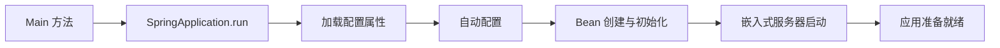

# ☕ 后端开发

> **“设计精良的后端是任何可扩展应用的基石。”**

掌握 Java 生态系统，构建健壮、高性能的后端服务。

---

## 🍃 Spring Boot

### 核心概念

#### 应用启动流程



#### 常用注解

| 注解 | 用途 |
|------------|---------|
| `@SpringBootApplication` | 启动入口（组合三个注解） |
| `@RestController` | 定义 REST API 端点 |
| `@Service` | 标记业务逻辑 Bean |
| `@Repository` | 标记数据访问 Bean |
| `@Configuration` | Java 配置类 |
| `@Bean` | 定义 Spring 管理的 Bean |
| `@Autowired` | 依赖注入 |

#### 自动配置
Spring Boot 根据 classpath 中的依赖自动配置 Bean。

### 请求处理
示例：一个处理用户 REST 请求的 Controller。

---

## ⚡ 并发编程 (JUC)

### 线程池

```java
// 推荐：使用线程池，而非手动创建线程
ExecutorService executor = Executors.newFixedThreadPool(10);

// 最佳实践：自定义 ThreadPoolExecutor，精细调优参数
ThreadPoolExecutor executor = new ThreadPoolExecutor(
    5,                      // corePoolSize
    10,                     // maxPoolSize
    60L, TimeUnit.SECONDS,  // keepAliveTime
    new LinkedBlockingQueue<>(100),  // workQueue (有界队列)
    new ThreadPoolExecutor.CallerRunsPolicy()  // 拒绝策略 (背压控制)
);
```

### CompletableFuture

```java
// 异步组合与编排
public CompletableFuture<OrderSummary> processOrder(Order order) {
    return CompletableFuture
        .supplyAsync(() -> validateOrder(order)) // 异步执行验证
        .thenCompose(this::checkInventory)     // 串联异步操作
        .thenCombine(calculateShipping(order), this::createSummary) // 合并异步结果
        .exceptionally(ex -> handleError(ex)); // 异常处理
}

// 并行执行多个任务
CompletableFuture.allOf(task1, task2, task3)
    .thenAccept(v -> {
        // 所有任务完成后执行
    });
```

### 锁与同步

| 机制 | 用途 |
|-----------|----------|
| `synchronized` | 简单互斥 |
| `ReentrantLock` | 更精细的控制（可尝试锁、公平锁） |
| `ReadWriteLock` | 多读单写场景 |
| `StampedLock` | 乐观读锁，极致性能 |
| `Semaphore` | 限制并发访问 |

---

## 🧠 JVM 内部原理

### 内存模型

```mermaid
flowchart TB
    subgraph "堆 (Heap)"
        A[年轻代 (Young Generation)]
        B[老年代 (Old Generation)]
        A --> |对象晋升| B
    end
    
    subgraph "非堆区 (Non-Heap)"
        C[元空间 (Metaspace)]
        D[代码缓存 (Code Cache)]
        E[线程栈 (Thread Stacks)]
    end
    
    subgraph "年轻代 (Young Generation)"
        F[Eden 区]
        G[Survivor 0 区]
        H[Survivor 1 区]
    end
```

### 垃圾回收 (Garbage Collection)

| GC 类型 | 特点 | 最适合场景 |
|---------|----------------|----------|
| **G1** | 低延迟，均衡 | 通用场景（默认） |
| **ZGC** | 超低停顿（< 10ms） | 大堆内存、对延迟敏感的场景 |
| **Parallel** | 高吞吐量 | 批处理 |

### JVM 调优参数

```bash
# 常用生产环境设置
java -Xms4g -Xmx4g \           # 堆内存大小（最小 = 最大）
     -XX:+UseG1GC \             # 使用 G1 垃圾收集器
     -XX:MaxGCPauseMillis=200 \ # 目标停顿时间
     -XX:+HeapDumpOnOutOfMemoryError 
     -Xlog:gc*:file=gc.log \    # GC 日志记录
     -jar app.jar
```

### 性能分析与监控

```bash
# JFR (Java Flight Recorder)
jcmd <pid> JFR.start duration=60s filename=recording.jfr

# jstat - GC 统计
jstat -gcutil <pid> 1000

# jmap - 堆转储
jmap -dump:live,format=b,file=heap.hprof <pid>
```

---

## 📐 API 设计

### RESTful API 最佳实践

| HTTP 方法 | 用途 | 幂等性 |
|-------------|---------|------------|
| GET | 获取资源 | 是 |
| POST | 创建资源 | 否 |
| PUT | 替换资源 | 是 |
| PATCH | 部分更新 | 是 |
| DELETE | 移除资源 | 是 |

### 统一响应结构

```java
// 统一的 API 响应格式
public record ApiResponse<T>(
    boolean success,
    T data,
    String message,
    Map<String, Object> metadata
) {
    public static <T> ApiResponse<T> success(T data) {
        return new ApiResponse<>(true, data, null, null);
    }
    
    public static <T> ApiResponse<T> error(String message) {
        return new ApiResponse<>(false, null, message, null);
    }
}
```

---

## 📝 详细主题

- **[并发编程](/docs/engineering/backend/concurrency)** - 从基础到虚拟线程和 AI Agent 应用
- [Spring Security](/docs/engineering/backend/spring-security)
- [数据库访问 (JPA/JDBC)](/docs/engineering/backend/database)
- [缓存策略](/docs/engineering/backend/caching)
- [微服务模式](/docs/engineering/backend/microservices)
- [测试最佳实践](/docs/engineering/backend/testing)

---

:::tip 性能优化提示
1. **连接池** - 使用 HikariCP (Spring Boot 默认)
2. **懒加载** - 仅在需要时才获取数据
3. **批量操作** - 减少数据库往返次数
4. **异步化** - 尽可能异步处理 I/O 操作
5. **先分析再优化** - 先度量，后优化
:::
