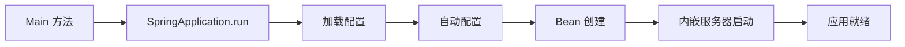
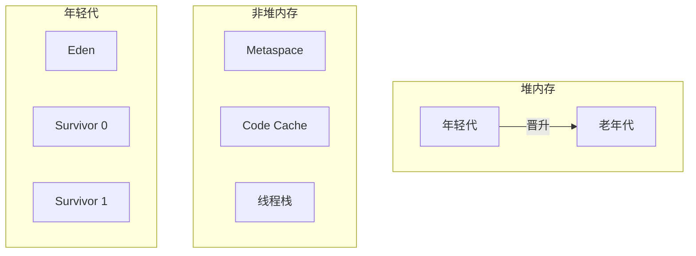

# 后端开发

> **"精心设计的后端是任何可扩展应用的基石。"**

掌握 Java 生态系统，构建健壮、高性能的后端服务。

---

## Spring Boot

### 核心概念

#### 应用启动流程



#### 常用注解

| 注解 | 用途 |
|------------|---------|
| `@SpringBootApplication` | 入口（组合了 3 个注解）|
| `@RestController` | REST API 端点 |
| `@Service` | 业务逻辑 Bean |
| `@Repository` | 数据访问 Bean |
| `@Configuration` | 基于 Java 的配置 |
| `@Bean` | 定义 Spring 管理的 Bean |
| `@Autowired` | 依赖注入 |

#### 自动配置

```java
// Spring Boot 基于 classpath 自动配置
// 添加 starter → 获得配置
@ConditionalOnClass(DataSource.class)
@ConditionalOnProperty(name = "spring.datasource.url")
@AutoConfiguration
public class DataSourceAutoConfiguration {
    // 自动创建 DataSource Bean
}
```

### 请求处理

```java
@RestController
@RequestMapping("/api/v1/users")
public class UserController {
    
    private final UserService userService;
    
    public UserController(UserService userService) {
        this.userService = userService;
    }
    
    @GetMapping("/{id}")
    public ResponseEntity<User> getUser(@PathVariable Long id) {
        return userService.findById(id)
            .map(ResponseEntity::ok)
            .orElse(ResponseEntity.notFound().build());
    }
    
    @PostMapping
    @ResponseStatus(HttpStatus.CREATED)
    public User createUser(@Valid @RequestBody CreateUserRequest request) {
        return userService.create(request);
    }
    
    @ExceptionHandler(UserNotFoundException.class)
    @ResponseStatus(HttpStatus.NOT_FOUND)
    public ErrorResponse handleNotFound(UserNotFoundException ex) {
        return new ErrorResponse(ex.getMessage());
    }
}
```

---

## 并发编程（JUC）

### 线程池

```java
// 推荐：使用线程池，不要直接创建线程
ExecutorService executor = Executors.newFixedThreadPool(10);

// 更好的方式：自定义 ThreadPoolExecutor，调整参数
ThreadPoolExecutor executor = new ThreadPoolExecutor(
    5,                      // corePoolSize
    10,                     // maxPoolSize
    60L, TimeUnit.SECONDS,  // keepAliveTime
    new LinkedBlockingQueue<>(100),  // workQueue
    new ThreadPoolExecutor.CallerRunsPolicy()  // 拒绝策略
);
```

### CompletableFuture

```java
// 异步组合
public CompletableFuture<OrderSummary> processOrder(Order order) {
    return CompletableFuture
        .supplyAsync(() -> validateOrder(order))
        .thenCompose(this::checkInventory)
        .thenCombine(calculateShipping(order), this::createSummary)
        .exceptionally(ex -> handleError(ex));
}

// 并行运行多个任务
CompletableFuture.allOf(task1, task2, task3)
    .thenAccept(v -> {
        // 所有任务完成
    });
```

### 锁和同步

| 机制 | 使用场景 |
|-----------|----------|
| `synchronized` | 简单互斥 |
| `ReentrantLock` | 更多控制（tryLock、公平锁）|
| `ReadWriteLock` | 多读单写 |
| `StampedLock` | 乐观读锁 |
| `Semaphore` | 限制并发访问 |

```java
// ReentrantLock 带超时
private final ReentrantLock lock = new ReentrantLock();

public void updateResource() {
    try {
        if (lock.tryLock(1, TimeUnit.SECONDS)) {
            try {
                // 临界区
            } finally {
                lock.unlock();
            }
        } else {
            throw new TimeoutException("无法获取锁");
        }
    } catch (InterruptedException e) {
        Thread.currentThread().interrupt();
    }
}
```

---

## JVM 内部原理

### 内存模型



### 垃圾收集

| GC 类型 | 特点 | 适用场景 |
|---------|-----------------|----------|
| **G1** | 低延迟、均衡 | 通用（默认）|
| **ZGC** | 超低暂停（10ms 以下）| 大堆内存、延迟敏感 |
| **Parallel** | 高吞吐 | 批处理 |
| **Shenandoah** | 低暂停、并发 | RedHat/OpenJDK |

### JVM 调优参数

```bash
# 常见生产环境设置
java -Xms4g -Xmx4g \           # 堆大小（最小 = 最大）
     -XX:+UseG1GC \             # 使用 G1 垃圾收集器
     -XX:MaxGCPauseMillis=200 \ # 目标暂停时间
     -XX:+HeapDumpOnOutOfMemoryError \
     -Xlog:gc*:file=gc.log \    # GC 日志
     -jar app.jar
```

### 性能分析和监控

```bash
# JFR（Java Flight Recorder）
jcmd <pid> JFR.start duration=60s filename=recording.jfr

# jstat - GC 统计
jstat -gcutil <pid> 1000

# jmap - 堆转储
jmap -dump:live,format=b,file=heap.hprof <pid>
```

---

## API 设计

### REST 最佳实践

| HTTP 方法 | 用途 | 幂等 |
|-------------|---------|------|
| GET | 获取资源 | 是 |
| POST | 创建资源 | 否 |
| PUT | 替换资源 | 是 |
| PATCH | 部分更新 | 是 |
| DELETE | 删除资源 | 是 |

### 响应结构

```java
// 统一 API 响应
public record ApiResponse<T>(
    boolean success,
    T data,
    String message,
    Map<String, Object> metadata
) {
    public static <T> ApiResponse<T> success(T data) {
        return new ApiResponse<>(true, data, null, null);
    }
    
    public static <T> ApiResponse<T> error(String message) {
        return new ApiResponse<>(false, null, message, null);
    }
}
```

---

## 详细主题

- **[并发编程](/docs/engineering/backend/concurrency)** - 从基础到虚拟线程和 AI Agent 应用
- [Spring Security](/docs/engineering/backend/spring-security)
- [数据库访问（JPA/JDBC）](/docs/engineering/backend/database)
- [缓存策略](/docs/engineering/backend/caching)
- [微服务模式](/docs/engineering/backend/microservices)
- [测试最佳实践](/docs/engineering/backend/testing)

---

:::tip 性能优化建议
1. **连接池** - 使用 HikariCP（Spring Boot 默认）
2. **懒加载** - 只在需要时获取数据
3. **批量操作** - 减少数据库往返
4. **尽量异步** - 不要阻塞 I/O
5. **先分析再优化** - 测量优先
:::
