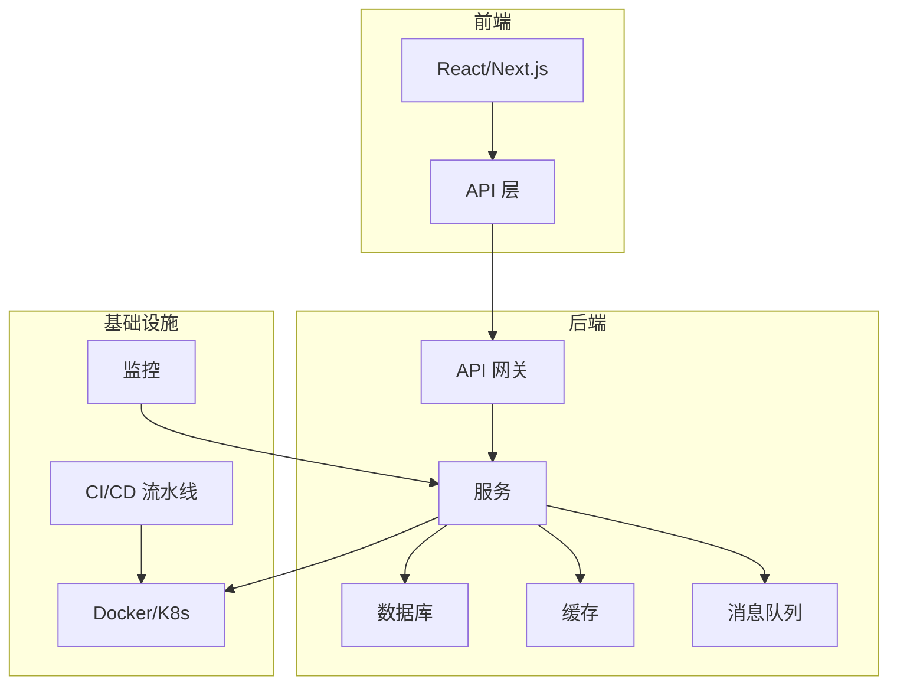
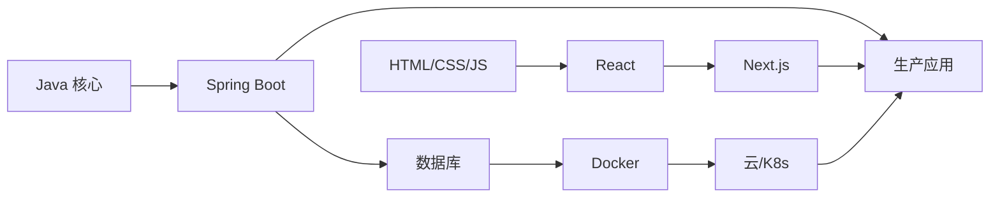

# 🛠️ 工程实践

> **"优秀的工程师不是由他们知道什么来定义的，而是由他们能构建什么来定义的。"**

本节涵盖构建、部署和维护生产应用所需的**实用工程技能**。从后端架构到前端体验，从容器到 CI/CD 流水线。

---

## 📚 涵盖主题

### [后端（Java 生态）](/docs/engineering/backend)
构建健壮、可扩展的服务端应用。
- Spring Boot 核心概念与注解
- JUC 并发编程（java.util.concurrent）
- JVM 内部原理与垃圾回收调优
- API 设计与微服务模式

### [前端（现代 Web）](/docs/engineering/frontend)
创建响应式、交互式的用户体验。
- React 基础与 Hooks
- Next.js 全栈应用开发
- Tailwind CSS 与现代样式方案
- 状态管理模式

### [DevOps 与云](/docs/engineering/devops)
大规模部署和运维应用。
- Docker 容器化
- Kubernetes 编排
- AWS / Google Cloud 服务
- GitHub Actions CI/CD

### [开发者工具](/docs/engineering/tools)
使用合适的工具最大化生产力。
- Git 高级工作流
- IDE 精通（IntelliJ IDEA）
- 终端与 Shell 配置
- 调试与性能分析

---

## 🏗️ 全栈架构



---

## 🎯 技术栈

| 层级 | 主要技术 |
|------|---------|
| **前端** | React, Next.js, TypeScript, Tailwind CSS |
| **后端** | Java 21, Spring Boot 3, PostgreSQL, Redis |
| **DevOps** | Docker, Kubernetes, GitHub Actions, AWS |
| **工具** | Git, IntelliJ IDEA, VS Code, Zsh |

---

## 📖 快速参考

### 常用 Spring 注解

```java
@RestController      // REST API 控制器
@Service             // 业务逻辑
@Repository          // 数据访问
@Transactional       // 事务管理
@Async               // 异步执行
@Scheduled           // 定时任务
@Cacheable           // 方法缓存
```

### 常用 Docker 命令

```bash
docker build -t app:latest .
docker run -d -p 8080:8080 app:latest
docker compose up -d
docker logs -f container_name
docker exec -it container_name /bin/sh
```

### Git 工作流命令

```bash
git rebase -i HEAD~3      # 交互式变基
git cherry-pick <sha>     # 精选提交
git stash push -m "msg"   # 带消息暂存
git bisect start          # 二分查找 bug
```

---

## 🎯 学习路径



---

:::tip 工程原则
1. **为人写代码** - 清晰胜于技巧
2. **快速失败** - 在开发中尽早发现问题
3. **自动化一切** - 做过两次的事就写成脚本
4. **先度量再优化** - 用数据说话，不要靠猜
5. **持续学习** - 技术领域在不断变化
:::
