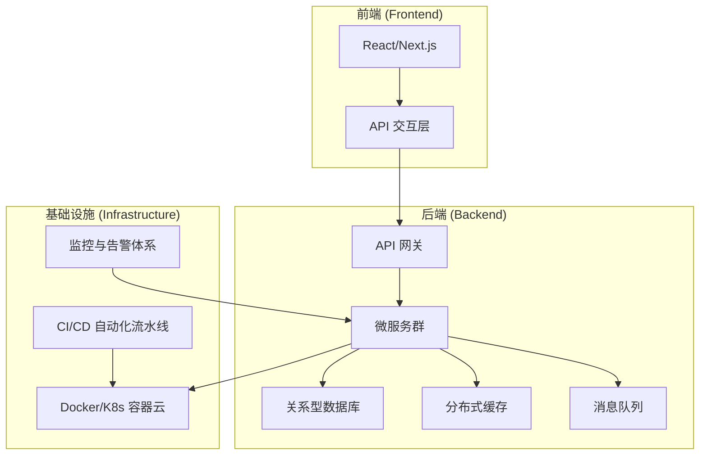
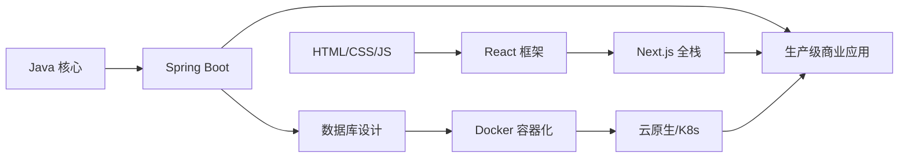

# 🛠️ 工程实战

> **“伟大的工程师不仅在于他们知道什么，更在于他们能构建出什么。”**

本章节涵盖了构建、部署和维护生产级应用所需的**实战工程技能**。从后端架构到前端体验，从容器化技术到 CI/CD 流水线，为您提供全方位的技术指引。

---

## 📚 涵盖主题

### [后端开发 (Java 生态)](/docs/engineering/backend)
构建稳健、可扩展的服务端应用。
- Spring Boot 核心概念与常用注解
- 基于 JUC (java.util.concurrent) 的并发编程
- JVM 内部原理与垃圾回收 (GC) 调优
- API 设计与微服务架构模式

### [前端开发 (现代 Web)](/docs/engineering/frontend)
打造响应式、交互性强的用户体验。
- React 基础与 Hooks 深度解析
- 使用 Next.js 构建全栈应用
- Tailwind CSS 与现代样式方案
- 状态管理模式 (State Management)

### [DevOps 与云原生](/docs/engineering/devops)
实现大规模应用的部署与自动化运维。
- Docker 容器化技术
- Kubernetes (K8s) 集群编排
- AWS / Google Cloud 核心服务
- 基于 GitHub Actions 的 CI/CD 流水线

### [开发者工具](/docs/engineering/tools)
工欲善其事，必先利其器。
- Git 高级工作流
- IDE 提效技巧 (IntelliJ IDEA)
- 终端与 Shell 环境配置
- 调试 (Debugging) 与性能分析 (Profiling)

---

## 🏗️ 全栈架构全景图



---

## 🎯 核心技术栈

| 层次 | 主流技术选型 |
|-------|---------------------|
| **前端** | React, Next.js, TypeScript, Tailwind CSS |
| **后端** | Java 21, Spring Boot 3, PostgreSQL, Redis |
| **DevOps** | Docker, Kubernetes, GitHub Actions, AWS |
| **工具** | Git, IntelliJ IDEA, VS Code, Zsh |

---

## 📖 核心知识速查

### 常用 Spring 注解

```java
@RestController      // 定义 REST API 控制器
@Service             // 标记业务逻辑层
@Repository          // 标记数据访问层
@Transactional       // 开启声明式事务
@Async               // 开启异步执行
@Scheduled           // 配置定时任务
@Cacheable           // 启用方法级缓存
```

### 必备 Docker 命令

```bash
docker build -t app:latest .        # 构建镜像
docker run -d -p 8080:8080 app:latest # 运行容器
docker compose up -d               # 启动编排服务
docker logs -f container_name      # 实时查看日志
docker exec -it container_name /bin/sh # 进入容器终端
```

### Git 高级工作流

```bash
git rebase -i HEAD~3      # 交互式变基（合并/修改提交）
git cherry-pick <sha>     # 挑选特定的提交
git stash push -m "msg"   # 暂存当前更改
git bisect start          # 二分法定位 Bug 提交点
```

---

## 🎯 工程师成长路径



---

:::tip 工程化原则 (Principles)
1. **代码是写给人看的** —— 清晰度远比所谓的“奇技淫巧”重要。
2. **尽早失败 (Fail Fast)** —— 在开发阶段尽早捕捉错误。
3. **自动化一切** —— 如果一件事情你需要重复做两次，请写脚本。
4. **度量驱动优化** —— 先做性能分析 (Profile)，不要盲目猜测。
5. **保持终身学习** —— 技术浪潮瞬息万变。
:::
