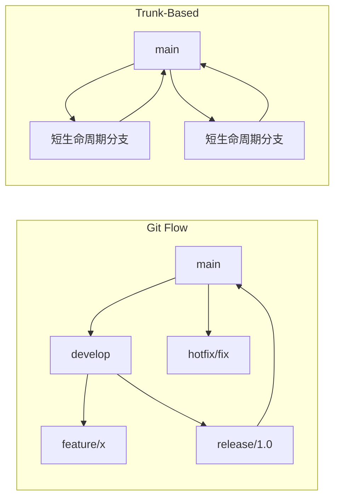

# 🧰 开发者工具

> **"工匠的水平取决于工具——以及对工具的掌握程度。"**

用合适的工具和配置最大化生产力。

---

## 📝 Git 高级用法

### 常用命令

```bash
# 交互式 rebase - PR 前整理历史
git rebase -i HEAD~5
# 命令：pick、reword、edit、squash、fixup、drop

# 摘取特定提交
git cherry-pick abc123

# 查找某行的修改者
git blame -L 10,20 src/App.java

# 二分查找引入 bug 的提交
git bisect start
git bisect bad                 # 当前提交有问题
git bisect good v1.0           # 这个版本没问题
# Git 会自动二分搜索

# 带消息的暂存
git stash push -m "WIP: feature implementation"
git stash list
git stash pop stash@{0}

# 撤销操作
git reset --soft HEAD~1        # 撤销提交，保留暂存更改
git reset --mixed HEAD~1       # 撤销提交，取消暂存
git reset --hard HEAD~1        # 撤销提交，丢弃更改（危险！）
git reflog                     # 查找丢失的提交
```

### Git Flow vs Trunk-Based



### 实用别名

```bash
# ~/.gitconfig
[alias]
    st = status -sb
    co = checkout
    br = branch
    ci = commit
    lg = log --oneline --graph --decorate -20
    undo = reset --soft HEAD~1
    amend = commit --amend --no-edit
    wip = !git add -A && git commit -m "WIP: work in progress"
    cleanup = !git branch --merged | grep -v main | xargs git branch -d
```

---

## 💻 IntelliJ IDEA

### 常用快捷键（Mac）

| 操作 | 快捷键 |
|------|--------|
| **全局搜索** | ⇧⇧（双击 Shift）|
| **查找动作** | ⌘⇧A |
| **跳转到文件** | ⌘⇧O |
| **跳转到符号** | ⌘⌥O |
| **最近文件** | ⌘E |
| **跳转到类** | ⌘O |
| **重命名** | ⇧F6 |
| **提取变量** | ⌘⌥V |
| **提取方法** | ⌘⌥M |
| **生成代码** | ⌘N |
| **快速修复** | ⌥Enter |
| **查找用法** | ⌥F7 |
| **跳转到定义** | ⌘B |
| **跳转到实现** | ⌘⌥B |
| **显示参数** | ⌘P |
| **快速文档** | F1 |
| **格式化代码** | ⌘⌥L |
| **优化导入** | ⌃⌥O |

### 必装插件

| 插件 | 用途 |
|------|------|
| **GitHub Copilot** | AI 代码补全 |
| **SonarLint** | 代码质量分析 |
| **Rainbow Brackets** | 彩色括号匹配 |
| **Key Promoter X** | 快捷键学习 |
| **GitToolBox** | 增强 Git 集成 |
| **String Manipulation** | 文本转换工具 |
| **Indent Rainbow** | 可视化缩进 |

### Live Templates

```java
// 输入：sout + Tab
System.out.println($END$);

// 输入：psvm + Tab
public static void main(String[] args) {
    $END$
}

// 自定义：在 Settings > Editor > Live Templates 中创建
// log + Tab
private static final Logger log = LoggerFactory.getLogger($CLASS$.class);
```

---

## 🖥️ 终端与 Shell

### Zsh 配置

```bash
# ~/.zshrc

# Oh My Zsh
export ZSH="$HOME/.oh-my-zsh"
ZSH_THEME="powerlevel10k/powerlevel10k"

plugins=(
    git
    zsh-autosuggestions
    zsh-syntax-highlighting
    docker
    kubectl
    fzf
)

source $ZSH/oh-my-zsh.sh

# 别名
alias ll='ls -la'
alias ..='cd ..'
alias ...='cd ../..'
alias gs='git status -sb'
alias gco='git checkout'
alias gcm='git commit -m'
alias gp='git push'
alias gl='git pull'
alias k='kubectl'
alias d='docker'
alias dc='docker compose'

# 函数
mkcd() { mkdir -p "$1" && cd "$1"; }
port() { lsof -i :"$1"; }
killport() { lsof -ti :"$1" | xargs kill -9; }
```

### 必备 CLI 工具

| 工具 | 用途 | 安装 |
|------|------|------|
| **fzf** | 模糊查找器 | `brew install fzf` |
| **ripgrep (rg)** | 快速搜索 | `brew install ripgrep` |
| **fd** | 快速文件查找 | `brew install fd` |
| **bat** | 增强版 cat | `brew install bat` |
| **exa/eza** | 增强版 ls | `brew install eza` |
| **jq** | JSON 处理器 | `brew install jq` |
| **htop** | 进程查看器 | `brew install htop` |
| **tldr** | 简化版 man | `brew install tldr` |
| **httpie** | 增强版 curl | `brew install httpie` |
| **lazygit** | Git TUI 工具 | `brew install lazygit` |

### Vim 基础

```bash
# .vimrc 或 neovim 基础配置
set number          # 行号
set relativenumber  # 相对行号
set tabstop=4       # Tab 宽度
set shiftwidth=4    # 缩进宽度
set expandtab       # 用空格代替 Tab
set autoindent      # 自动缩进
set clipboard=unnamed  # 使用系统剪贴板

# 基本移动
h j k l           # 左、下、上、右
w b              # 按词前进/后退
0 $              # 行首/行尾
gg G             # 文件开头/结尾
/pattern         # 搜索
n N              # 下一个/上一个匹配

# 基本命令
i a              # 插入模式（光标前/后）
dd yy p          # 删除/复制行，粘贴
u ⌃r             # 撤销/重做
:w :q :wq        # 保存/退出/保存并退出
:%s/old/new/g    # 全局替换
```

---

## 🐞 调试与分析

### JVM 调试

```bash
# 远程调试
java -agentlib:jdwp=transport=dt_socket,server=y,suspend=n,address=*:5005 -jar app.jar

# 内存分析
jmap -histo <pid>                    # 对象直方图
jmap -dump:format=b,file=heap.hprof <pid>  # 堆转储

# 线程分析
jstack <pid>                         # 线程转储
jcmd <pid> Thread.print              # 替代方案

# 性能分析
java -XX:+UnlockCommercialFeatures -XX:+FlightRecorder ...
jcmd <pid> JFR.start duration=60s filename=recording.jfr
```

### 浏览器 DevTools

| 标签 | 用途 |
|-----|------|
| **Elements** | DOM 检查、CSS 调试 |
| **Console** | JS 执行、日志 |
| **Network** | API 调用、性能 |
| **Performance** | 运行时分析 |
| **Application** | 存储、Cookie、缓存 |
| **Lighthouse** | 性能审计 |

---

## 📝 详细主题

- [Git Rebase 策略](/docs/engineering/tools/git-rebase)
- [Docker 开发环境](/docs/engineering/tools/docker-dev)
- [VS Code 配置](/docs/engineering/tools/vscode)
- [生产力工作流](/docs/engineering/tools/productivity)
- [API 测试（Postman、httpie）](/docs/engineering/tools/api-testing)

---

:::tip 生产力建议
1. **学习键盘快捷键** - 每次鼠标点击都在浪费时间
2. **定制你的环境** - 在 .dotfiles 上投入时间
3. **自动化重复任务** - 脚本长期节省大量时间
4. **一切用版本控制** - 包括 dotfiles
5. **保持更新** - 工具在进化，你的工作流也应该如此
:::
