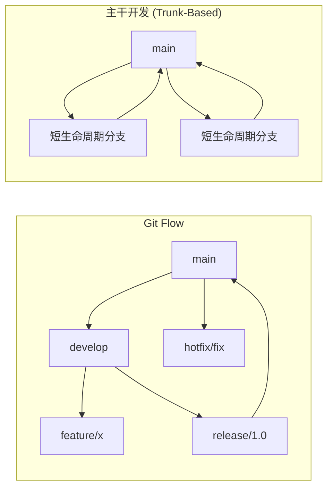

# 🧰 开发者工具

> **“工欲善其事，必先利其器——且要精通其用法。”**

通过合适的工具和配置，最大化你的生产力。

---

## 📝 Git 高级工作流

### 必备命令

```bash
# 交互式变基 (rebase -i) - 在 PR 前清理提交历史
git rebase -i HEAD~5
# 命令示例: pick, reword, edit, squash, fixup, drop

# 挑选特定提交 (Cherry-pick)
git cherry-pick abc123

# 查找是谁修改了某行代码
git blame -L 10,20 src/App.java

# 二分法定位 Bug 引入点
git bisect start
git bisect bad                 # 当前提交是坏的
git bisect good v1.0           # 这个版本是好的
# Git 会二分查找提交

# 带消息的暂存 (Stash)
git stash push -m "WIP: 功能实现中"
git stash list
git stash pop stash@{0}

# 撤销失误
git reset --soft HEAD~1        # 撤销提交，保留更改在暂存区
git reset --mixed HEAD~1       # 撤销提交，取消暂存更改
git reset --hard HEAD~1        # 撤销提交，丢弃更改 (危险操作!)
git reflog                     # 查找丢失的提交
```

### Git Flow vs Trunk-Based Development



### 常用 Git 别名

```bash
# ~/.gitconfig
[alias]
    st = status -sb
    co = checkout
    br = branch
    ci = commit
    lg = log --oneline --graph --decorate -20
    undo = reset --soft HEAD~1
    amend = commit --amend --no-edit
    wip = !git add -A && git commit -m "WIP: work in progress"
    cleanup = !git branch --merged | grep -v main | xargs git branch -d
```

---

## 💻 IntelliJ IDEA

### 必备快捷键 (Mac)

| 操作 | 快捷键 |
|--------|----------|
| **全局搜索** | ⇧⇧ (双击 Shift) |
| **查找动作** | ⌘⇧A |
| **前往文件** | ⌘⇧O |
| **前往符号** | ⌘⌥O |
| **最近文件** | ⌘E |
| **导航至类** | ⌘O |
| **重命名** | ⇧F6 |
| **提取变量** | ⌘⌥V |
| **提取方法** | ⌘⌥M |
| **生成代码** | ⌘N |
| **快速修复** | ⌥Enter |
| **查找用法** | ⌥F7 |
| **前往定义** | ⌘B |
| **前往实现** | ⌘⌥B |
| **显示参数** | ⌘P |
| **快速文档** | F1 |
| **代码格式化** | ⌘⌥L |
| **优化导入** | ⌃⌥O |

### 必装插件

| 插件 | 用途 |
|--------|---------|
| **GitHub Copilot** | AI 代码补全 |
| **SonarLint** | 代码质量分析 |
| **Rainbow Brackets** | 彩虹括号匹配 |
| **Key Promoter X** | 快速学习快捷键 |
| **GitToolBox** | 增强型 Git 集成 |
| **String Manipulation** | 文本转换工具 |
| **Indent Rainbow** | 缩进可视化 |

### 实时模板 (Live Templates)

```java
// 输入: sout + Tab
System.out.println($END$);

// 输入: psvm + Tab
public static void main(String[] args) {
    $END$
}

// 自定义: 在 Settings > Editor > Live Templates 中创建
// log + Tab
private static final Logger log = LoggerFactory.getLogger($CLASS$.class);
```

---

## 🖥️ 终端与 Shell

### Zsh 配置 (oh-my-zsh)

```bash
# ~/.zshrc

# Oh My Zsh
export ZSH="$HOME/.oh-my-zsh"
ZSH_THEME="powerlevel10k/powerlevel10k"

plugins=(
    git                 # Git 插件
    zsh-autosuggestions # 历史命令自动补全
    zsh-syntax-highlighting # 语法高亮
    docker              # Docker 命令补全
    kubectl             # Kubernetes 命令补全
    fzf                 # 模糊查找
)

source $ZSH/oh-my-zsh.sh

# 常用别名
alias ll='ls -la'
alias ..='cd ..'
alias ...='cd ../..'
alias gs='git status -sb'
alias gco='git checkout'
alias gcm='git commit -m'
alias gp='git push'
alias gl='git pull'
alias k='kubectl'
alias d='docker'
alias dc='docker compose'

# 常用函数
mkcd() { mkdir -p "$1" && cd "$1"; } # 创建目录并进入
port() { lsof -i :"$1"; }             # 查看端口占用
killport() { lsof -ti :"$1" | xargs kill -9; } # 杀死端口进程
```

### 必备 CLI 工具

| 工具 | 用途 | 安装命令 (macOS Homebrew) |
|------|---------|---------------------|
| **fzf** | 模糊文件/历史查找 | `brew install fzf` |
| **ripgrep (rg)** | 极速 Grep | `brew install ripgrep` |
| **fd** | 极速 Find | `brew install fd` |
| **bat** | 增强型 `cat`（代码高亮） | `brew install bat` |
| **eza** | 增强型 `ls`（树状视图） | `brew install eza` |
| **jq** | JSON 处理器 | `brew install jq` |
| **htop** | 实时进程查看器 | `brew install htop` |
| **tldr** | 简化 `man` 手册 | `brew install tldr` |
| **httpie** | 增强型 `curl` | `brew install httpie` |
| **lazygit** | Git 命令行 UI | `brew install lazygit` |

### Vim 核心技巧

```bash
# .vimrc 或 Neovim 基础配置
set number          # 显示行号
set relativenumber  # 显示相对行号
set tabstop=4       # Tab 宽度
set shiftwidth=4    # 缩进宽度
set expandtab       # Tab 键转换为空格
set autoindent      # 自动缩进
set clipboard=unnamed  # 使用系统剪贴板

# 核心移动操作
h j k l           # 左, 下, 上, 右
w b              # 向前/向后移动一个词
0 $              # 行首/行尾
gg G             # 文件开头/结尾
/pattern         # 搜索
n N              # 下一个/上一个匹配项

# 核心命令
i a              # 插入模式 (光标前/后)
dd yy p          # 删除/复制行, 粘贴
u ⌃r             # 撤销/重做
:w :q :wq        # 保存/退出/保存并退出
:%s/old/new/g    # 全局替换
```

---

## 🐞 调试与性能分析

### JVM 调试

```bash
# 远程调试
java -agentlib:jdwp=transport=dt_socket,server=y,suspend=n,address=*:5005 -jar app.jar

# 内存分析
jmap -histo <pid>                    # 对象直方图
jmap -dump:format=b,file=heap.hprof <pid>  # 堆转储 (Heap Dump)

# 线程分析
jstack <pid>                         # 线程转储 (Thread Dump)
jcmd <pid> Thread.print              # 另一种方式

# 性能分析 (JFR - Java Flight Recorder)
java -XX:+UnlockCommercialFeatures -XX:+FlightRecorder ...
jcmd <pid> JFR.start duration=60s filename=recording.jfr
```

### 浏览器 DevTools

| 标签页 | 用途 |
|--------|---------|
| **Elements** | DOM 检查，CSS 调试 |
| **Console** | JS 执行，日志输出 |
| **Network** | API 调用，性能分析 |
| **Performance** | 运行时性能分析 |
| **Application** | 本地存储、Cookies、缓存 |
| **Lighthouse** | 性能审计 |

---

## 📝 详细主题

- [Git Rebase 策略](/docs/engineering/tools/git-rebase)
- [Docker 开发环境配置](/docs/engineering/tools/docker-dev)
- [VS Code 高效设置](/docs/engineering/tools/vscode)
- [生产力工作流](/docs/engineering/tools/productivity)
- [API 测试 (Postman, httpie)](/docs/engineering/tools/api-testing)

---

:::tip 效率提升小贴士
1. **掌握键盘快捷键** - 每一个鼠标点击都在浪费时间。
2. **自定义你的环境** - 投入时间配置你的 .dotfiles。
3. **自动化重复性任务** - 脚本能为你节省大量时间。
4. **所有内容都用版本控制** - 包括你的配置文件。
5. **保持更新** - 工具在不断演进，你的工作流也应如此。
:::
