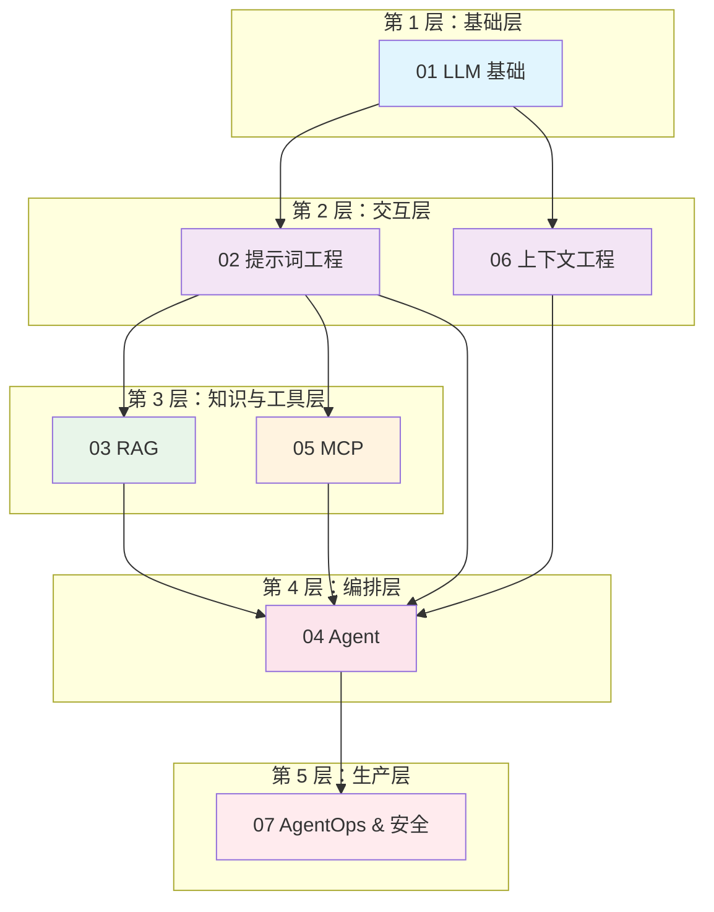

# AI Agent 工程手册

> **"最好的 AI 工程师既理解模型，也理解工程。"**

本知识库构建了一个从 LLM 基础知识到生产级 AI Agent 系统的完整技术闭环。

## 核心公式

```
Agent = 模型 (大脑) + 提示词 (指令) + 记忆 (RAG/上下文) + 工具 (MCP) + 规划 (架构)
```

---

## 1. 系统架构概览

此图表展示了 7 个模块之间的逻辑依赖关系：



**模块连接方式：**

- **LLM 基础**提供计算和推理基础
- **提示词 & 上下文**是与模型交互的媒介
- **RAG**为模型提供静态知识支持
- **MCP**为模型提供动态工具支持
- **Agent**编排和协调以上所有组件
- **Ops & 安全**贯穿整个生命周期

---

## 2. 模块概述

| ID | 模块 | 一句话定义 | 关键技术与关键词 |
|----|------|------------|-----------------|
| **01** | LLM 基础 | 理解"大脑"机制、训练流程和物理局限性 | Transformer, Attention, 预训练, RLHF, Tokenization, 推理参数 (Temp/Top-P) |
| **02** | 提示词工程 | 编写"指令代码"以激发推理并标准化输出格式 | Chain-of-Thought (CoT), Few-shot, ReAct, XML/JSON 输出, Persona |
| **03** | RAG | 用外部"库"增强模型，解决幻觉并注入私有数据 | 向量数据库, Embeddings, 分块, 混合搜索, Grounding, Self-Querying |
| **04** | Agent | 从"对话"进化到"行动"，包含规划、反思和工具使用 | Orchestration, 循环控制, Reflection, Router, 多 Agent (Supervisor/Hierarchical) |
| **05** | MCP | 模型上下文协议 - 标准 AI 连接 (USB-C)，将模型与工具解耦 | Host/Client/Server, Resources, Tools, Prompts, JSON-RPC, Stdio/SSE |
| **06** | 上下文工程 | 管理模型"注意力"窗口和长短时记忆，防止过载 | KV Cache, 上下文窗口, 短期/长期记忆, 信息压缩 |
| **07** | AgentOps & 安全 | 将演示转换为生产应用，包含安全、可观测性和评估 | Eval (LLM-as-a-Judge), 提示词注入, Docker 部署, Tracing |

---

## 3. 学习路径

根据你的开发目标选择合适的路径。

### 实践者路径 (实用开发者)

**目标：** 快速构建一个可以访问网络和查询数据库的 Java AI Agent。

**推荐顺序：**

1. **05 MCP**：首先了解如何编写工具（服务器）
2. **04 Agent**：学习如何让模型调用这个工具
3. **02 提示词**：优化指令以获得更准确的调用
4. **07 Ops**：部署到 Docker（参考 Brave Search 案例）

**重点：** 快速迭代、可工作的代码、生产部署

### 架构师路径 (架构师/研究员)

**目标：** 设计复杂的企业级多 Agent 系统。

**推荐顺序：**

1. **01 基础**：理解模型能力边界
2. **04 Agent**：设计多 Agent 协作模式
3. **06 上下文**：设计支持长工作流的记忆系统
4. **03 RAG**：规划企业知识库集成

**重点：** 系统设计、可扩展性模式、架构权衡

---

## 4. 快速参考

常见任务的必备资源 - 避免深入阅读文档。

### 标准 Agent 系统提示词模板

[查看模板指南](./prompt-engineering/)

### MCP 服务器标准代码结构 (Java/Spring)

[查看 Java 实现指南](./spring-ai/)

### RAG 分块策略速查表

[查看 RAG 优化指南](./rag/)

### 推荐的 LLM 参数

| 参数 | 保守模式 | 创新模式 | 编程模式 |
|------|----------|----------|----------|
| **Temperature** | 0.0 - 0.3 | 0.7 - 1.0 | 0.1 - 0.2 |
| **Top-P** | 0.9 | 0.95 | 0.9 |
| **Max Tokens** | 1024 | 2048 | 4096 |
| **Frequency Penalty** | 0.0 | 0.3 | 0.0 |

---

## 5. 导航指南

### 核心模块

- **[LLM 基础](./llm-fundamentals/)** - Transformer 架构、训练、推理、局限性
- **[提示词工程](./prompt-engineering/)** - CoT、few-shot、ReAct 模式、输出格式化
- **[RAG](./rag/)** - 向量数据库、embeddings、检索策略、grounding
- **[Agent](./agents/)** - 编排、多 Agent 系统、规划、反思
- **[MCP](./mcp/)** - 协议规范、服务器实现、工具、资源
- **[上下文工程](./context-engineering/)** - 上下文窗口、记忆系统、优化
- **[AgentOps & 安全](./agentops-security/)** - 部署、监控、安全、事件响应

### 额外资源

- **[Java & AI 实习指南](./internship/)** - 职业发展、实用技能

---

## 6. 关键概念速览

### Token 经济学

- **1 token** ~= 0.75 个英文单词 ~= 4 个字符
- **上下文窗口** = 每次请求的最大 token 数（因模型而异）
- **KV 缓存** = 缓存的先前 token 以加速生成

### RAG 管道

```
查询 -> Embedding -> 向量搜索 -> 上下文组装 -> LLM -> 响应
```

### Agent 决策循环

```
观察 -> 推理 -> 行动 -> 观察 -> 推理 -> 行动 ...
```

### MCP 连接模型

```
Host (应用) <-> Client (协议) <-> Server (工具/数据)
```

---

## 7. 常见模式

### 模式 1：ReAct Agent

```
思考：[分析情况]
行动：[调用工具]
观察：[查看结果]
思考：[规划下一步]
行动：[继续或完成]
```

### 模式 2：路由 Agent

```
分类查询 -> 路由到专业 Agent -> 汇总结果
```

### 模式 3：分层 Agent

```
主管 Agent -> 工作 Agent -> 汇报结果 -> 综合处理
```

---

## 8. 生产环境检查清单

部署到生产环境前：

- [ ] 所有工具都有适当的错误处理
- [ ] 敏感操作需要人工批准
- [ ] 启用全面的审计日志
- [ ] 实现并测试了紧急停止机制
- [ ] 配置了速率限制
- [ ] 实施了成本控制
- [ ] 监控仪表板处于活跃状态
- [ ] 事件响应流程已文档化
- [ ] 安全审查已完成
- [ ] 已进行负载测试

---

:::tip 入门指南
AI 工程领域的新手？从 **[LLM 基础](./llm-fundamentals/)** 开始了解模型工作原理，然后学习 **[提示词工程](./prompt-engineering/)** 掌握有效的提示词模式。
:::

:::info 给 Java 开发者
如果你使用 Spring Boot 构建 AI 应用，请查看 **[MCP](./mcp/)** 了解标准化工具集成，以及 **[AgentOps](./agentops-security/)** 了解生产部署模式。
:::