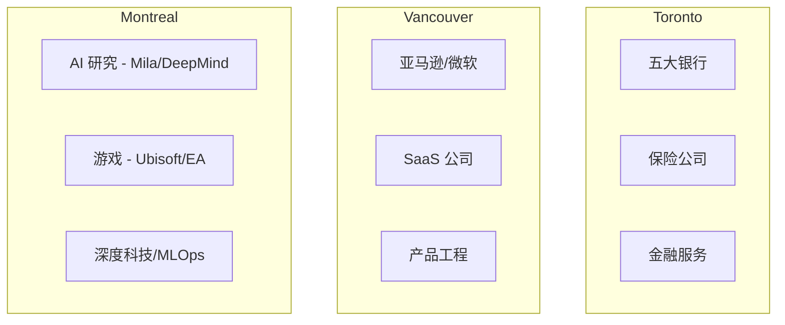
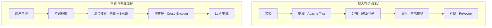
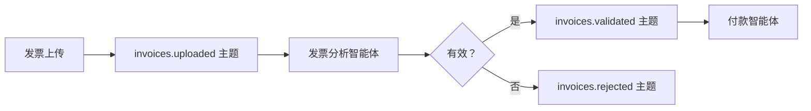

# 战略性职业发展路线图：2026 年加拿大 Java & AI 实习市场

> **"通用技能的时代已经结束。精通企业级 Java 和智能体 AI 的交叉领域。"**

---

## 1. 宏观战略环境：2026 年加拿大科技劳动力市场

截至 2026 年，加拿大科技行业已从由投机增长定义的格局，转变为以工程效率与监管合规为特征的成熟格局。对于国际计算机科学本科生而言，环境呈现两极分化：虽然通用型初级开发者的总体需求因自动化和经济整合而有所减弱，但"AI 原生后端工程师"（能够将大型语言模型编织到企业 Java 系统刚性结构中的人才）的特定需求已达到一个拐点，形成严重的稀缺性。

本报告对此细分领域进行了法证分析。它超越通用的职业建议，提供基于证据的路线图，指导在加拿大移民政策、企业架构和不断发展的技术面试挑战之间导航。

### 1.1 移民和工作授权的悖论

2026 年国际学生面临的最重要非技术障碍是由加拿大移民、难民和公民部（IRCC）管理的不断发展的监管框架。继 2024 年引入的配额上限并在 2026-2028 年移民水平计划中巩固以来，市场目睹了学习许可数量的减少，将 2026 年的入学规模稳定在约 **408,000 个许可**。

雇主，尤其是大型跨国公司以外的雇主，常常在雇用国际学生的行政负担方面存在模糊性。普遍的误解将"国际学生"与"LMIA（劳动力市场影响评估）责任"等同。然而，**实习安排明确免除**此要求。

:::tip 工作授权沟通的战略脚本
表达 LMIA 要求与实习豁免之间的区别，与技术能力同样重要。
:::

#### 表 1：工作授权沟通的战略脚本

| 雇主关注/问题 | "高摩擦"回答（避免） | "零风险"战略回答（推荐） |
|----------------|---------------------|------------------------|
| **"你是否有合法授权在加拿大工作？"** | "没有，但我可以申请许可。" <br/><br/>*暗示：不确定性、延迟和 HR 的行政工作。* | "是的。我持有有效的学习许可，并有资格申请实习工作许可。这是与我的大学课程挂钩的开放工作许可，不需要贵公司提供赞助或 LMIA。" |
| **"你将来是否需要赞助？"** | "是的，我希望最终能获得 PR。" <br/><br/>*暗示：候选人可能流失或成为未来的法律费用。* | "在整个实习期间和随后的 3 年毕业工作许可（PGWP）期间，我都拥有完整、独立的工作授权。我不需要雇主赞助即可开始或维持就业。" |
| **"你的工作时间限制是什么？"** | "我想我可以工作 20 小时，夏天全职？" <br/><br/>*暗示：候选人不了解法律，造成合规风险。* | "作为注册的实习学生，我已被 IRCC 授权在指定工作期间全职工作（每周 40+ 小时）。在此期间我无限制地可用。" |

:::info 推荐资源
- IRCC 官网"作为学生或实习生工作"页面
- 英属哥伦比亚大学国际学生指南
- 关注学生在学习和工作许可之间过渡的"维持身份"条款
:::

### 1.2 区域招聘动态："三大"枢纽

Java 和 AI 技能在加拿大地理分布上并不均匀。市场分为三个截然不同的集群，每个都有独特的产业特征。



#### Toronto：企业堡垒

多伦多仍然是无可争议的金融中心，拥有"五大"银行（RBC、TD、Scotiabank、BMO、CIBC）和主要保险公司（Sun Life、Manulife）的总部。

| 方面 | 详情 |
|--------|---------|
| **技术人设** | "安全创新者" - 优先选择 Java (Spring Boot) 以获得类型安全、成熟生态系统和安全功能 |
| **AI 实现** | 内部知识管理的 RAG 系统；强烈避免将个人信息发送到公共 LLM |
| **招聘量** | 高 - 银行已有正式的"技术与运营"招聘渠道 |
| **目标公司** | RBC、TD、Scotiabank、Sun Life、Rogers、Telus |

#### Vancouver：产品与规模化中心

温哥华的生态系统深受美国西海岸影响，拥有亚马逊、微软的主要工程办公室，以及 Clio 和 Hootsuite 等充满活力的 SaaS 公司层。

| 方面 | 详情 |
|--------|---------|
| **技术人设** | "产品工程师" - 重视速度和用户体验；多语言环境 |
| **AI 实现** | 智能体工作流程 - AI 为用户执行功能的特点 |
| **招聘量** | 中等到高，竞争激烈 |
| **目标公司** | 亚马逊、Clio、SAP、Hootsuite、Unbounce |

#### Montreal：深度科技与研究中心

蒙特利尔是全球 AI 研究（Mila、Google DeepMind）和游戏产业（Ubisoft、EA）的重镇。

| 方面 | 详情 |
|--------|---------|
| **技术人设** | "系统优化者" - 研究使用 C++ 和 Python，生产化使用 Java/Go |
| **AI 实现** | 高复杂性 - 优化推理延迟，管理大规模数据集 |
| **文化特点** | 双语是优势；展示对法语的兴趣是重要的文化信号 |
| **目标公司** | Ubisoft、Autodesk、Morgan Stanley、CAE |

#### 表 2：区域技能优先级矩阵

| 城市 | 主要行业 | 主导技术栈 | AI 聚焦领域 |
|------|-------------------|---------------------|---------------|
| **Toronto** | 金融、保险、电信 | Java 21, Spring Boot, 微服务, Angular | 内部 RAG, 欺诈检测, 合规机器人 |
| **Vancouver** | SaaS, 电子商务, 云 | Java, Python, AWS, React, Kafka | 客户智能体, 自动化工作流, 个性化 |
| **Montreal** | 游戏, 航空航天, AI 研究 | C++, Python, Java (MLOps) | 深度学习, 强化学习, 仿真 |

---

## 2. 框架之争：Spring AI vs. LangChain4j

2026 年 Java 开发者面临的最关键技术选择是编排框架的选择。行业已经超越了编写对 OpenAI API 的原始 HTTP 请求；现代智能体的复杂性——管理记忆、上下文窗口、工具和 RAG 管道——需要一个强大的框架。

### 2.1 Spring AI：企业标准

Spring AI 是 Spring 团队的官方项目，旨在使 AI 集成感觉上对 Spring 生态系统是"原生的"。

| 方面 | 详情 |
|--------|---------|
| **架构理念** | "可移植性和抽象" - 将应用代码与特定模型提供商解耦 |
| **关键组件** | **Advisors API** - 类似 Spring AOP，允许对聊天请求/响应流进行透明拦截 |
| **目标受众** | 多伦多的金融机构和大企业 |

```java
ChatClient.builder(chatModel)
   .defaultAdvisors(new MessageChatMemoryAdvisor(chatMemory))
   .build()
   .prompt("What is my balance?")
   .call();
```

### 2.2 LangChain4j：敏捷创新者

LangChain4j 是流行的 Python LangChain 库的 Java 端口。它是社区驱动的，发展极其快速，并且经常在 Spring AI 出现之前数月就实现前沿研究论文。

| 方面 | 详情 |
|--------|---------|
| **架构理念** | "功能对等性和表现力" - 将"智能体"革命的全部力量带给 Java |
| **关键组件** | **@AiService** - 使用 Java 代理模式的高级声明式 API |
| **目标受众** | 温哥华和蒙特利尔的初创公司和规模化企业 |

```java
@AiService
public interface BankingAssistant {
    @SystemMessage("You are a helpful bank teller. If the request is about fraud, use the FraudTool.")
    @UserMessage("Check the status of transaction {{transactionId}}")
    TransactionStatus checkStatus(String transactionId);
}
```

#### 表 3：面试框架选择指南

| 功能 | Spring AI | LangChain4j | 面试策略 |
|---------|-----------|-------------|-------------------|
| **集成** | 原生（Starters, Actuator） | 良好（Quarkus/Spring Starters） | "我在需要可观察性和标准配置的微服务中使用 Spring AI。" |
| **简单性** | 高（有观点的） | 中等（灵活的） | "我使用 LangChain4j 进行快速原型设计，当我需要像 ReAct 这样的高级智能体模式时。" |
| **智能体支持** | 增长中（函数调用） | 成熟（ReAct, Plan-and-Execute） | 如果面试重点在自主智能体，强调 LangChain4j 经验 |
| **RAG** | 标准（Advisors） | 高级（混合搜索, 重排序） | 讨论复杂的 RAG 角色的 LangChain4j 摄入管道 |

---

## 3. AI 系统设计：2026 架构

实习生的"系统设计"面试已经发展。在 2026 年，候选人被期望理解 LLM 应用的架构。

### 3.1 高级 RAG 架构（Java 实现）

检索增强生成（RAG）是"幻觉"问题的标准解决方案。生产实现需要复杂的管道。



#### 摄入管道 (ETL)

| 阶段 | 描述 | 最佳实践 |
|-------|-------------|----------------|
| **提取** | 使用 Apache Tika 解析 PDF、Word 文档、HTML | 处理编码问题 |
| **分块** | 将文档分割用于嵌入 | 使用 50 个 token 重叠的递归字符分割器 |
| **嵌入** | 将文本转换为向量 | 首选本地模型（ONNX）以保护隐私 |
| **存储** | 向量数据库 | 企业级合规使用 PgVector（PostgreSQL） |

#### 检索与生成流程（在线）

1. **查询转换** - 重写模糊查询以获得更好的搜索意图
2. **混合搜索** - 向量 + BM25/关键字用于精确匹配
3. **重排序** - 在将前 5 个结果发送给 LLM 之前使用交叉编码器模型进行精确化

### 3.2 事件驱动智能体架构（Kafka + AI）

2026 架构的前沿是事件驱动智能体。与同步 HTTP 不同，智能体通过 Apache Kafka 异步通信。



:::info 为什么这很重要
这种架构实现了巨大的可扩展性。您可以运行 50 个发票智能体实例来处理流量激增，而不会压倒付款智能体。完美契合微服务理念。
:::

---

## 4. 面试挑战：银行 vs. 初创公司

### 4.1 "五大"银行面试（TD、RBC、BMO、CIBC、Scotiabank）

| 方面 | 详情 |
|--------|---------|
| **主要筛选** | 风险与合规 - "这个人会破坏构建、泄露数据或导致合规事件吗？" |
| **平台** | HackerRank 或 Codility |
| **语言** | 通常锁定为 Java |
| **主题** | 字符串操作、数组、HashMap |
| **陷阱** | 未能处理"边缘情况"（null 输入、空文件） |

**技术知识重点：**
- Spring Boot：依赖注入、Scope、@Transactional
- 安全：API 密钥处理、PII 遮蔽
- 测试：JUnit 和 Mockito（在面试中编写测试 = 前 10%）

### 4.2 初创/规模化公司面试（Clio、Wealthsimple、Cohere）

| 方面 | 详情 |
|--------|---------|
| **主要筛选** | 速度与产品感 - "这个人能够在没有手把手指导的情况下端到端构建功能吗？" |
| **平台** | CoderPad（实时结对编程）或家庭作业项目 |
| **语言** | 允许多语言，后端首选 Java/Kotlin |
| **风格** | 实际应用 - "调用这个天气 API，解析 JSON，缓存结果" |
| **陷阱** | 过度工程化 - 先构建 MVP，再优化 |

**系统设计重点：**
- 延迟和 UX - "我们如何流式传输 LLM 响应？"（答案：SSE）
- 成本 - "我们如何防止 LLM 预算烧完？"（答案：Token 限制、Redis 缓存）

#### 表 4：面试准备矩阵

| 指标 | 银行策略 | 初创公司策略 |
|--------|---------------|------------------|
| **代码结构** | 冗长的企业模式（DTO、服务层） | 清洁、简洁、函数式风格 |
| **关键概念** | ACID 合规、线程安全、PII 保护 | 最终一致性、API 延迟、UX |
| **行为面试** | 严格的 STAR 方法。关注"冲突解决"和"流程" | 对话式。关注"所有权"、"学习"和"热情" |
| **工具使用** | Eclipse/IntelliJ（社区版）、Maven | IntelliJ（终极版）、Docker、Gradle |

---

## 5. 战略作品集开发：简历与项目

在一个充斥着通用"Chat with PDF"教程的市场中，您的作品集必须展示企业级复杂性。

### 5.1 简历关键词优化

申请人跟踪系统（ATS）扫描特定的技能"集群"。

**"Java AI 工程师"关键词集群：**
- **核心**：Java 21, Spring Boot 3, REST API, 微服务, Hibernate/JPA, Maven, Junit 5
- **AI/LLM**：RAG, 向量数据库 (PgVector, Milvus), 嵌入, 提示词工程, 函数调用, LangChain4j, Spring AI
- **基础设施**：Docker, Kubernetes, Kafka, Redis, PostgreSQL, Git, CI/CD (GitHub Actions)

:::tip 内幕
不要列出通用术语如"AI"或"机器学习"。要具体："使用 Spring AI 和 PgVector 实现了 RAG 管道。"
:::

### 5.2 三个独特的"Java + AI"顶点项目

#### 项目 1："FinAgent" – 交易银行智能体

**目标：** 银行（TD、RBC）

**概念：** 一个安全的银行智能体，不只是聊天，而是执行操作。"转账 50 美元给 Alice。"

**技术栈：** Java 21, Spring Boot, Spring AI, PostgreSQL

**关键功能：** 带有 OAuth2 护栏的函数调用
```java
@Tool
public TransferResult transferMoney(String to, BigDecimal amount) {
    // 执行前检查 SCOPE_WRITE 权限
    // 超过 100 美元的转账需要人工介入循环
}
```

**面试故事：** "我构建了一个执行金融交易的智能体，但我实现了一个'人工介入循环'确认步骤，任何超过 100 美元的转账都需要确认，以防止 AI 幻觉耗尽账户。"

#### 项目 2："EventFlow" – 事件驱动的客户支持智能体

**目标：** 规模化公司（Shopify、Clio）

**技术栈：** Java, LangChain4j, Apache Kafka, Redis

**架构：**
- 服务 A（摄取）→ tickets.new 主题
- 服务 B（分类智能体）→ 分析情感，路由到 tickets.urgent 或 tickets.routine
- 服务 C（自动回复器）→ 生成草稿回复

**面试故事：** "展示如何启动 10 个分类智能体实例来处理流量激增。这证明您理解分布式系统。"

#### 项目 3："CodeGraph" – 开发者的语义代码搜索

**目标：** 开发者工具公司 / 深度科技

**技术栈：** Java, Spring Boot, Neo4j（图数据库）

**关键功能：** GraphRAG - 使用知识图谱映射类和方法之间的关系

**面试故事：** "标准向量搜索无法理解代码的继承层次结构，所以我使用 Neo4j 实现了 GraphRAG 方法来捕获结构关系。"

---

## 6. 综合准备课程（4 周训练营）

#### 表 5：4 周执行计划

| 周 | 重点领域 | 每日任务和里程碑 | 推荐工具/教科书 |
|------|------------|--------------------------|----------------------------|
| **第 1 周** | 企业 Java 核心 | 周一至周二：Java 21 特性（Records、模式匹配、虚拟线程）<br/>周三至周四：Spring Boot 3（依赖注入、AOP、事务管理）<br/>周五至周日：构建项目 1（FinAgent）骨架 | "Modern Java in Action"（Manning）<br/>Spring Academy（免费课程）<br/>IntelliJ IDEA Community |
| **第 2 周** | AI 工程与框架 | 周一至周二：Spring AI 深入研究。实现 Advisors<br/>周三至周四：RAG 实现。设置 PgVector<br/>周五至周日：LeetCode "前 75 题"（数组和字符串） | Spring AI 参考文档<br/>DeepLearning.AI "使用 LLM 构建系统"<br/>Ollama（本地 LLM 测试） |
| **第 3 周** | 系统设计与架构 | 周一至周二：Kafka 基础（生产者、消费者、组）<br/>周三至周四：构建项目 2（EventFlow）<br/>周五至周日：系统设计练习 | "System Design Interview Vol 2"（Alex Xu）<br/>"Kafka: The Definitive Guide"<br/>Excalidraw（图表） |
| **第 4 周** | 面试打磨与申请 | 周一：简历最终定稿<br/>周二：行为准备（5 个 STAR 故事）<br/>周三：模拟面试<br/>周四至周五：申请 20 个职位<br/>周末：LeetCode "Blind 75" 复习 | "Cracking the Coding Interview"<br/>Levels.fyi（薪资/面试数据）<br/>LinkedIn（人脉） |

---

## 6.1 结论

2026 年实习市场是一个熔炉，将"编码员"与"工程师"区分开来。通用技能的时代已经结束。通过掌握企业级 Java 和智能体 AI 的交叉领域，并通过战略精确地导航移民环境，国际学生从被动申请人转变为高价值资产。

对此特定技能组合——构建可靠、安全和智能系统的能力——是未来十年加拿大科技部门的定义特征。

:::success 关键要点
以这个建筑蓝图为驱动，结果将随之而来。
:::