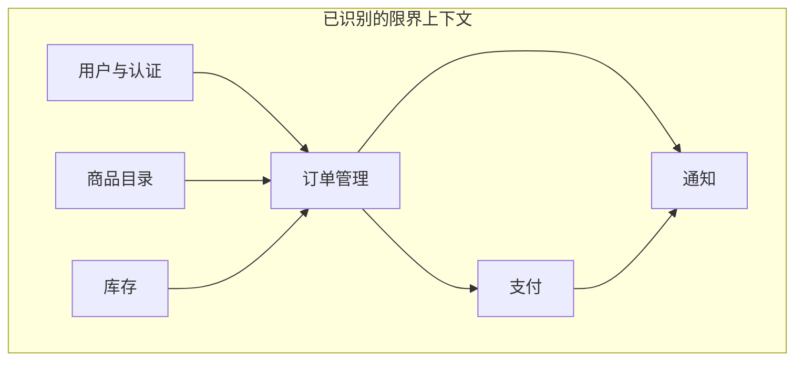
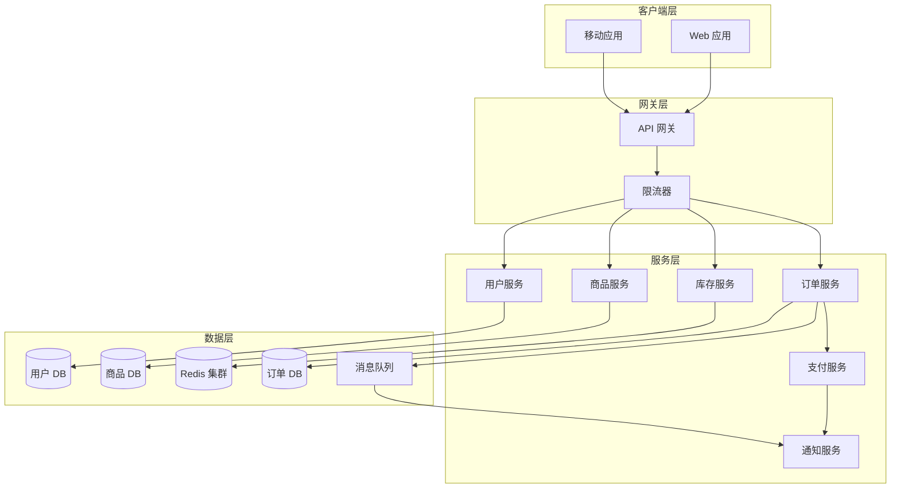
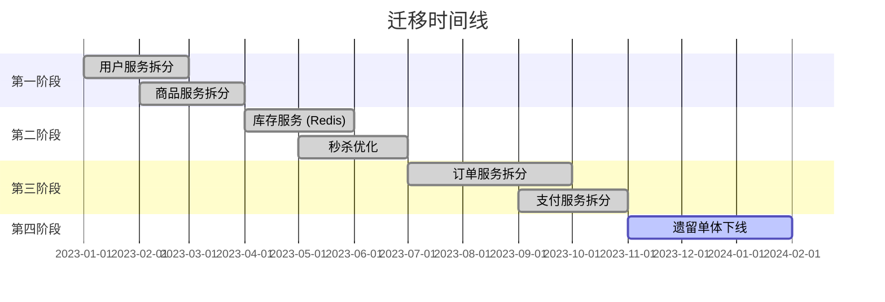

# 🛒 电商微服务重构

> **在不宕机的情况下，将单体应用转型为可扩展的微服务架构。**

---

## 1. 问题陈述

### 业务背景
电商平台在秒杀活动期间出现严重的性能问题。单体应用无法独立扩展特定组件，高峰期的数据库锁导致级联故障。

### 技术挑战
- **流量峰值**：秒杀期间 100 倍正常负载
- **超卖问题**：竞态条件导致库存超卖
- **数据库瓶颈**：高峰期单个 PostgreSQL 实例 CPU 100%
- **单体复杂性**：50 万+ 行代码，3 年以上技术债

### 成功标准
- **零超卖** 在秒杀活动期间
- **亚秒级结算** 响应时间 (p99)
- **99.9% 可用性** 在高峰事件期间
- **关键服务独立部署**

---

## 2. 研究与分析

### 拆分策略

我们使用领域驱动设计（DDD）原则分析单体应用：



### 迁移方案

| 策略 | 优势 | 劣势 | 我们的选择 |
|----------|------|------|------------|
| **大爆炸式** | 干净利落 | 高风险、长时间冻结 | ❌ |
| **绞杀者模式** | 渐进式、低风险 | 周期较长 | ✅ |
| **并行运行** | 安全验证 | 双倍基础设施 | 部分采用 ✅ |

**决策**：绞杀者模式，关键路径（库存、结算）采用并行运行。

---

## 3. 架构设计

### 目标架构



### 服务边界

| 服务 | 职责 | 数据库 | 通信方式 |
|---------|---------------|----------|---------------|
| **用户** | 认证、用户资料 | PostgreSQL | 同步 (REST) |
| **商品** | 目录、搜索 | PostgreSQL + ES | 同步 (REST) |
| **库存** | 库存管理 | Redis | 同步 (REST) |
| **订单** | 订单生命周期 | PostgreSQL | 异步 (MQ) |
| **支付** | 支付处理 | PostgreSQL | 异步 (MQ) |
| **通知** | 邮件、短信、推送 | - | 异步 (MQ) |

---

## 4. 实现要点

### 秒杀库存：防止超卖

这是最关键的挑战。我们实现了多层解决方案：

#### 第一层：Redis + Lua 原子操作

```java
@Service
public class InventoryService {

    private static final String DEDUCT_STOCK_SCRIPT = """
        local stock = redis.call('GET', KEYS[1])
        if not stock then
            return -1  -- 商品未找到
        end

        local current = tonumber(stock)
        local quantity = tonumber(ARGV[1])

        if current < quantity then
            return 0  -- 库存不足
        end

        redis.call('DECRBY', KEYS[1], quantity)
        return 1  -- 成功
        """;

    public DeductResult deductStock(String productId, int quantity) {
        // Redis 中的原子操作 - 无竞态条件
        Long result = redisTemplate.execute(
            RedisScript.of(DEDUCT_STOCK_SCRIPT, Long.class),
            List.of("stock:" + productId),
            String.valueOf(quantity)
        );

        return switch (result.intValue()) {
            case 1 -> DeductResult.SUCCESS;
            case 0 -> DeductResult.INSUFFICIENT_STOCK;
            case -1 -> DeductResult.PRODUCT_NOT_FOUND;
            default -> DeductResult.ERROR;
        };
    }
}
```

#### 第二层：分布式限流

```java
@Component
public class FlashSaleRateLimiter {

    // 滑动窗口限流器
    private static final String RATE_LIMIT_SCRIPT = """
        local key = KEYS[1]
        local limit = tonumber(ARGV[1])
        local window = tonumber(ARGV[2])
        local now = tonumber(ARGV[3])

        -- 移除过期条目
        redis.call('ZREMRANGEBYSCORE', key, 0, now - window)

        -- 统计当前窗口数量
        local count = redis.call('ZCARD', key)

        if count >= limit then
            return 0  -- 被限流
        end

        -- 添加当前请求
        redis.call('ZADD', key, now, now .. ':' .. math.random())
        redis.call('EXPIRE', key, window / 1000)

        return 1  -- 允许
        """;

    public boolean allowRequest(String userId, String saleId) {
        String key = String.format("rate:%s:%s", saleId, userId);
        Long now = System.currentTimeMillis();

        Long result = redisTemplate.execute(
            RedisScript.of(RATE_LIMIT_SCRIPT, Long.class),
            List.of(key),
            "5",      // 5 次请求
            "1000",   // 每 1 秒窗口
            String.valueOf(now)
        );

        return result == 1;
    }
}
```

#### 第三层：带背压的请求队列

```java
@Service
public class FlashSaleOrderService {

    private final RocketMQTemplate rocketMQTemplate;
    private final RedissonClient redisson;

    public OrderResult placeOrder(OrderRequest request) {
        // 1. 限流检查
        if (!rateLimiter.allowRequest(request.userId(), request.saleId())) {
            return OrderResult.rateLimited();
        }

        // 2. 扣减库存 (Redis)
        DeductResult deductResult = inventoryService.deductStock(
            request.productId(),
            request.quantity()
        );

        if (deductResult != DeductResult.SUCCESS) {
            return OrderResult.fromDeductResult(deductResult);
        }

        // 3. 生成订单号
        String orderId = generateOrderId();

        // 4. 发送到异步处理队列
        rocketMQTemplate.asyncSend(
            "flash-sale-orders",
            new FlashSaleOrderMessage(orderId, request),
            new SendCallback() {
                @Override
                public void onSuccess(SendResult result) {
                    // 订单已入队等待处理
                }

                @Override
                public void onException(Throwable e) {
                    // 回滚库存
                    inventoryService.restoreStock(
                        request.productId(),
                        request.quantity()
                    );
                }
            }
        );

        return OrderResult.queued(orderId);
    }
}
```

### 数据库拆分

从单一数据库迁移到每服务独立数据库：

```java
// 分布式事务的 Saga 模式
@Service
public class OrderSagaOrchestrator {

    public OrderResult createOrder(CreateOrderCommand command) {
        Saga<OrderContext> saga = Saga.<OrderContext>builder()
            .step("reserve-inventory")
                .action(ctx -> inventoryClient.reserve(ctx.items()))
                .compensation(ctx -> inventoryClient.release(ctx.reservationId()))
            .step("create-payment")
                .action(ctx -> paymentClient.createPayment(ctx.amount()))
                .compensation(ctx -> paymentClient.cancelPayment(ctx.paymentId()))
            .step("confirm-order")
                .action(ctx -> orderRepository.confirm(ctx.orderId()))
                .compensation(ctx -> orderRepository.cancel(ctx.orderId()))
            .build();

        return saga.execute(new OrderContext(command));
    }
}
```

---

## 5. 挑战与解决方案

### 挑战 1：跨服务数据一致性

**问题**：分布式事务很难。跨服务的 ACID 是不可能的。

**解决方案**：通过发件箱模式实现最终一致性

```java
@Transactional
public void completeOrder(Order order) {
    // 1. 更新订单状态
    orderRepository.save(order.complete());

    // 2. 写入发件箱（同一事务）
    outboxRepository.save(new OutboxEvent(
        "order.completed",
        order.getId(),
        objectMapper.writeValueAsString(order)
    ));
}

// 独立进程轮询发件箱并发布事件
@Scheduled(fixedDelay = 100)
public void publishOutboxEvents() {
    List<OutboxEvent> pending = outboxRepository.findPending(100);
    for (OutboxEvent event : pending) {
        try {
            messageQueue.publish(event.getTopic(), event.getPayload());
            outboxRepository.markPublished(event.getId());
        } catch (Exception e) {
            outboxRepository.incrementRetry(event.getId());
        }
    }
}
```

### 挑战 2：服务发现与负载均衡

**解决方案**：Kubernetes 原生服务发现 + Istio 流量管理

```yaml
# Istio VirtualService 用于金丝雀发布
apiVersion: networking.istio.io/v1beta1
kind: VirtualService
metadata:
  name: order-service
spec:
  hosts:
  - order-service
  http:
  - match:
    - headers:
        canary:
          exact: "true"
    route:
    - destination:
        host: order-service
        subset: v2
      weight: 100
  - route:
    - destination:
        host: order-service
        subset: v1
      weight: 90
    - destination:
        host: order-service
        subset: v2
      weight: 10
```

### 挑战 3：分布式系统监控

**解决方案**：OpenTelemetry 分布式追踪

```java
@RestController
public class OrderController {

    private final Tracer tracer;

    @PostMapping("/orders")
    public ResponseEntity<OrderResponse> createOrder(@RequestBody CreateOrderRequest request) {
        Span span = tracer.spanBuilder("createOrder")
            .setAttribute("order.user_id", request.getUserId())
            .setAttribute("order.total", request.getTotal())
            .startSpan();

        try (Scope scope = span.makeCurrent()) {
            // 业务逻辑
            OrderResult result = orderService.createOrder(request);

            span.setAttribute("order.id", result.getOrderId());
            span.setStatus(StatusCode.OK);

            return ResponseEntity.ok(result.toResponse());
        } catch (Exception e) {
            span.recordException(e);
            span.setStatus(StatusCode.ERROR, e.getMessage());
            throw e;
        } finally {
            span.end();
        }
    }
}
```

---

## 6. 结果与指标

### 秒杀活动性能（双十一事件）

| 指标 | 优化前 | 优化后 | 提升 |
|--------|--------|-------|-------------|
| **峰值 QPS** | 5,000 | 50,000+ | 10 倍 |
| **超卖事故** | 12 起 | 0 起 | -100% |
| **结算 p99** | 8.2s | 0.4s | -95% |
| **系统可用性** | 94% | 99.95% | +6% |

### 基础设施影响

| 资源 | 优化前（单体） | 优化后（微服务） |
|----------|-------------------|----------------------|
| **CPU 成本** | $5,000/月 | $3,200/月 |
| **扩容时间** | 5-10 分钟 | 30 秒 |
| **部署频率** | 每周 | 每日 20+ 次 |
| **MTTR** | 45 分钟 | 8 分钟 |

---

## 7. 经验教训

### 做得好的方面
- ✅ 绞杀者模式有效降低了风险
- ✅ Redis 用于库存是正确的选择
- ✅ 异步处理优雅应对了流量峰值
- ✅ 每服务独立数据库消除了锁竞争

### 可以改进的方面
- ⚠️ 应该更早投资分布式追踪
- ⚠️ 最初的服务边界划分过于细粒度（后来合并了一些）
- ⚠️ 团队需要更多分布式系统概念的培训

### 核心要点

1. **Redis Lua 脚本非常强大** - 原子操作可以解决很多竞态条件
2. **最终一致性是可以接受的** - 用户关心正确的结果，而不是即时更新
3. **队列是你的朋友** - 解耦以增强韧性
4. **可观测性至关重要** - 无法修复你看不到的问题
5. **从最热的路径开始** - 把迁移重点放在最大的痛点上

---

## 架构演进时间线



---

:::info 核心要点
微服务本身并不解决问题——它们只是让解决方案成为可能。真正的工作在于理解系统的瓶颈，并应用正确的模式（如 Redis + Lua 实现原子性、消息队列实现解耦）。
:::
