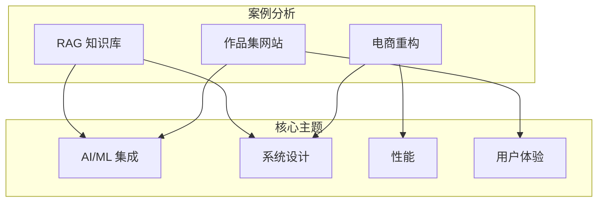

# 🚀 案例分析

> **"经验不是发生在你身上的事，而是你如何应对发生在你身上的事。"** — 阿道司·赫胥黎

本节超越代码，深入探索**真实世界的工程挑战**。每个案例分析都涵盖了决策过程、权衡取舍和经验教训。

---

## 🎯 为什么要写案例分析？

技术能力不仅通过代码展示，还体现在：

- **问题定义** - 你如何理解这个挑战？
- **架构决策** - 为什么选择这种方案？
- **权衡取舍** - 你得到了什么，又牺牲了什么？
- **经验教训** - 你从这次经历中学到了什么？

---

## 📖 精选项目

### [企业级 RAG 知识库](/docs/projects/rag-knowledge-base)
为内部文档搜索构建生产级 RAG 系统。
- **挑战**：PDF 表格解析和多模态文档处理
- **技术栈**：Spring Boot、PgVector、OpenAI、LangChain
- **核心收获**：分块策略对检索质量的影响至关重要

### [电商微服务重构](/docs/projects/ecommerce-refactor)
在应对秒杀活动的同时，将单体应用迁移到微服务架构。
- **挑战**：高流量秒杀场景下的超卖防护
- **技术栈**：Spring Cloud、Redis、RocketMQ、Kubernetes
- **核心收获**：分布式系统需要不同的思维方式

### [AI 驱动的个人作品集网站](/docs/projects/portfolio-website)
创建具有 AI 聊天功能的交互式作品集。
- **挑战**：边缘部署下的实时 AI 响应
- **技术栈**：Next.js、Tailwind CSS、Spring Boot、OpenAI
- **核心收获**：用户体验胜过技术复杂性

---

## 🔍 案例分析模板

每个案例分析遵循以下结构：

```markdown
## 1. 问题定义
- 业务背景和需求
- 技术约束
- 成功标准

## 2. 研究与分析
- 考虑的方案
- 概念验证
- 技术评估

## 3. 架构设计
- 高层架构图
- 组件拆解
- 数据流

## 4. 实现要点
- 关键技术决策
- 复杂逻辑的代码片段
- 集成模式

## 5. 挑战与解决方案
- 遇到的问题
- 尝试的方案
- 最终解决方案及原因

## 6. 结果与指标
- 性能提升
- 用户反馈
- 业务影响

## 7. 经验教训
- 做得好的地方
- 可以改进的地方
- 未来建议
```

---

## 📊 项目概览



---

## 🏆 影响总结

| 项目 | 挑战 | 解决方案 | 影响 |
|---------|-----------|----------|--------|
| **RAG KB** | 文档搜索准确性 | 混合搜索 + 重排序 | 85% → 96% 相关度 |
| **电商** | 秒杀超卖 | Redis + Lua 原子操作 | 0 起超卖事故 |
| **作品集** | 页面加载性能 | 边缘缓存 + 懒加载 | 2.1s → 0.8s LCP |

---

:::tip 如何写好案例分析
1. **讲故事** - 问题 → 探索 → 解决
2. **保持诚实** - 包含失败和转折
3. **展示推理** - 为什么不用其他方案？
4. **加入可视化** - 架构图、截图
5. **量化影响** - 指标展示真实价值
:::
