# 案例研究：Open SWE

> **"最好的内部工具是由每天使用它们的团队构建的。"** — LangChain 团队

**Open SWE**（Open Source Software Engineer，开源软件工程师）是 LangChain 用于构建内部编码代理的开源框架。基于 [LangGraph](https://www.langchain.com/langgraph) 和 [Deep Agents](https://docs.langchain.com/oss/python/deepagents/overview) 构建，它提供了一个生产就绪的架构，反映了 Stripe、Ramp 和 Coinbase 等精英工程组织使用的内部编码代理。

**项目**: [langchain-ai/open-swe](https://github.com/langchain-ai/open-swe)
**技术栈**: Python, LangGraph, Deep Agents, Modal/Daytona 沙箱
**许可证**: MIT

---

## 1. 项目概述与重要性

### 什么是 Open SWE？

Open SWE 是一个**异步、云原生的编码代理框架**，它能够：

- **接收来自** Slack、Linear 或 GitHub 提及的任务
- **为每个任务生成隔离的沙箱**
- **编排多代理工作流**来规划、实现和审查代码更改
- **自动创建与原始工单链接的拉取请求**

它代表了**内部工程工具的民主化**——使任何开发团队都能使用万亿美元公司使用的相同架构模式。

### 为什么这很重要

**问题**: 精英工程组织（Stripe、Ramp、Coinbase）已经构建了强大的内部编码代理，但它们的实现是专有的。行业缺乏开源的参考架构。

**Open SWE 的影响**：
- **参考架构**: 为内部编码代理提供生产蓝图
- **组合优于分叉**: 基于 Deep Agents 框架构建，支持升级和定制
- **可插拔设计**: 可以交换沙箱、模型、工具和触发器
- **社区创新**: 为特定于组织的扩展提供开放基础

### 与专有系统的关系

| 公司 | 内部工具 | Open SWE 等效方案 |
|---------|---------------|---------------------|
| **Stripe** | Minions | 多代理编排，规则文件 → AGENTS.md |
| **Ramp** | Inspect | 基于 OpenCode 构建 → Deep Agents |
| **Coinbase** | Cloudbot | Slack 原生，Linear 优先集成 |

---

## 2. 代理架构（核心重点）

这是 Open SWE 的核心——一个基于 **LangGraph 状态机架构**构建的复杂多代理系统。

### 高级架构

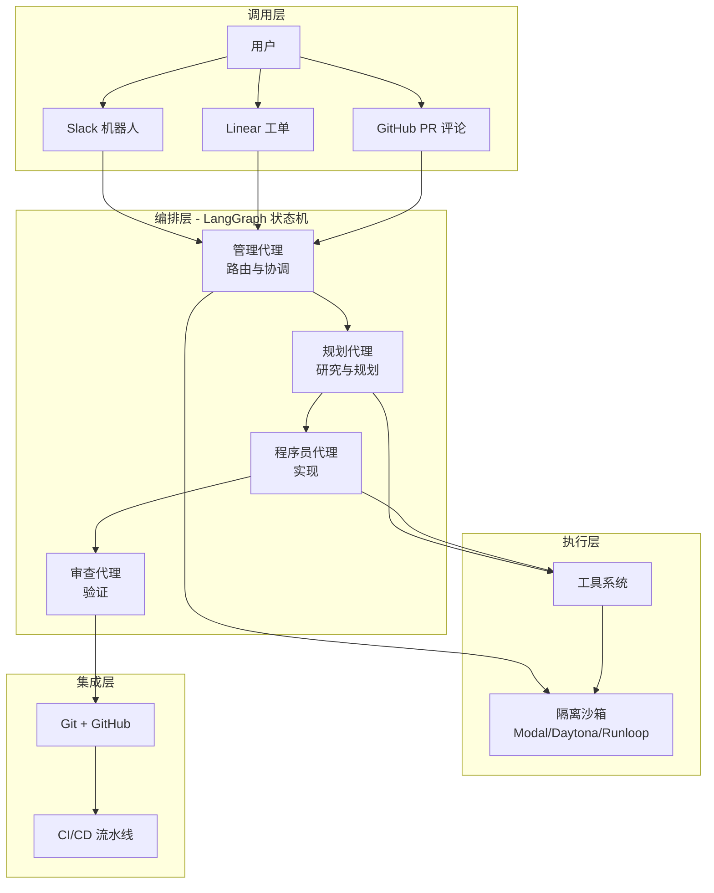

### 四代理系统

Open SWE 实现了一个**专门的多代理架构**，其中每个代理都有明确的职责：

#### 1. 管理代理
**角色**: 入口点和协调器

```python
# 高级概念（不是实际代码）
manager_agent = Agent(
    name="manager",
    system_prompt="路由任务和协调工作流",
    decisions=[
        "route_to_planner",    # 需要研究的新任务
        "route_to_programmer", # 简单直接的修复
        "respond_complete",    # 任务成功完成
        "respond_error"        # 任务失败
    ]
)
```

**职责**：
- 从 Slack/Linear/GitHub 接收初始任务
- 解析上下文（工单描述、线程历史）
- 决定是否路由到规划代理或程序员代理
- 协调代理之间的交接
- 将最终响应发送回触发源

#### 2. 规划代理
**角色**: 编码前的研究和规划

```python
# 概念：规划代理的工作流
planner_agent = Agent(
    name="planner",
    tools=[ls, grep, read_file, glob, fetch_url],
    system_prompt="分析代码库并创建逐步计划",
    output="structured_todos"
)
```

**职责**：
- **研究**代码库使用文件操作
- **分析** GitHub 问题或 Linear 工单
- **创建**使用 `write_todos` 工具的结构化计划
- **识别**需要修改的文件
- **提出**逐步执行策略

**使用的关键工具**：
| 工具 | 用途 |
|------|---------|
| `ls` | 列出目录内容 |
| `grep` | 搜索代码模式 |
| `read_file` | 读取文件内容 |
| `glob` | 按模式查找文件 |
| `fetch_url` | 获取文档 |

#### 3. 程序员代理
**角色**: 实现计划好的更改

```python
# 概念：程序员代理的工作流
programmer_agent = Agent(
    name="programmer",
    tools=[write_file, edit_file, execute, http_request],
    system_prompt="根据计划实现更改",
    constraints=["run_linters", "run_tests", "ensure_tests_pass"]
)
```

**职责**：
- **执行**规划代理创建的计划
- **写入/编辑**沙箱中的文件
- **运行**代码检查器和格式化工具
- **执行**测试以验证更改
- **迭代**直到测试通过

**使用的关键工具**：
| 工具 | 用途 |
|------|---------|
| `write_file` | 创建新文件 |
| `edit_file` | 修改现有文件 |
| `execute` | 运行 shell 命令（npm test、black 等） |
| `http_request` | 发出 API 调用 |

#### 4. 审查代理
**角色**: 发布前验证

```python
# 概念：审查代理的工作流
reviewer_agent = Agent(
    name="reviewer",
    tools=[execute, read_file, git_diff],
    system_prompt="审查更改并确保质量",
    checks=["code_quality", "test_coverage", "documentation"]
)
```

**职责**：
- **审查**所有代码更改
- **运行**最终验证测试
- **检查**边界情况
- **确保**代码检查器和格式化工具通过
- **减少**构建失败

### LangGraph 状态机

代理使用 **LangGraph** 进行编排，它提供：

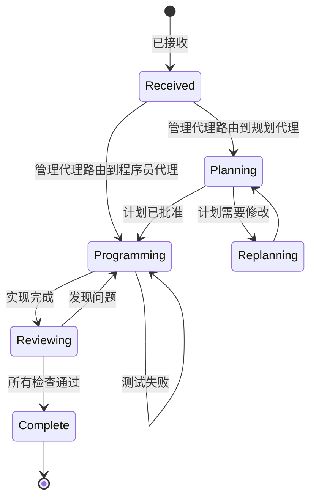

**为什么使用 LangGraph？**
- **确定性转换**: 代理之间清晰的交接
- **状态持久化**: 长时间运行的任务保持内存
- **循环预防**: 防止无限代理循环
- **人工监督**: 可以注入人工审查的检查点
- **表达力**: 不限于单一认知架构

### 工具系统

Open SWE 遵循 Stripe 的见解：**工具的精选比数量更重要**。

#### 核心工具

| 工具 | 类别 | 用途 |
|------|----------|---------|
| `execute` | Shell | 在沙箱中运行命令（bash、python、npm） |
| `fetch_url` | Web | 将网页作为 markdown 获取 |
| `http_request` | API | 发出 HTTP 请求（GET、POST 等） |
| `commit_and_open_pr` | Git | 提交更改 + 创建 GitHub 草稿 PR |
| `linear_comment` | 通信 | 在 Linear 工单中发布更新 |
| `slack_thread_reply` | 通信 | 在 Slack 线程中回复 |

#### Deep Agents 内置工具

| 工具 | 类别 | 用途 |
|------|----------|---------|
| `read_file` | 文件系统 | 读取文件内容 |
| `write_file` | 文件系统 | 创建新文件 |
| `edit_file` | 文件系统 | 修改现有文件（基于差异） |
| `ls` | 文件系统 | 列出目录内容 |
| `glob` | 文件系统 | 按模式查找文件 |
| `grep` | 文件系统 | 搜索文件内容 |
| `write_todos` | 规划 | 创建结构化任务列表 |
| `task` | 编排 | 生成子代理 |

#### 工具设计原则

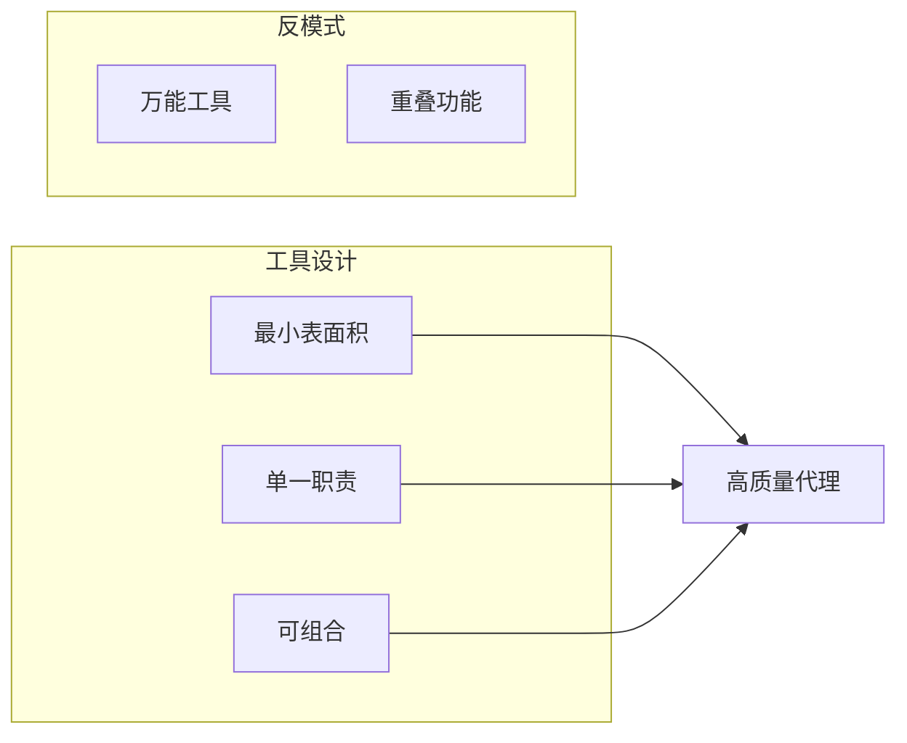

### 内存与上下文管理

#### AGENTS.md

Open SWE 读取存储在仓库根目录的 `AGENTS.md` 文件（如果存在）并将其注入到系统提示中。这是**仓库级别的规则手册**：

```markdown
# AGENTS.md 示例

## 代码风格
- 使用 4 个空格进行缩进
- Python 遵循 PEP 8
- 提交前运行 `black` 和 `isort`

## 测试要求
- 所有新功能都需要单元测试
- 测试覆盖率不得下降
- 提交前运行 `pytest`

## 架构规则
- 使用依赖注入
- 没有循环导入
- 数据库查询通过 repository 层进行
```

**类比**: 这是 Stripe 的"规则文件"概念——编码每个代理运行必须遵循的约定。

#### 源上下文

Open SWE 在代理开始前**组装丰富的上下文**：

- **Linear 工单**: 标题、描述、所有评论
- **Slack 线程**: 完整的对话历史
- **GitHub PR**: 描述 + 审查评论

这可以防止代理"通过工具调用发现所有内容"，并实现更快、更准确的响应。

#### 基于文件的内存

对于大型代码库，Open SWE 使用**基于文件的内存**：

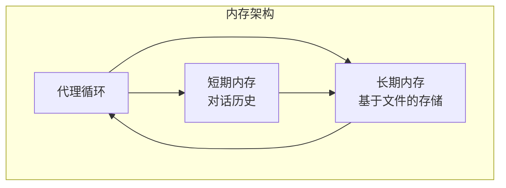

**优势**：
- **防止上下文溢出**: 大型代码库不会耗尽令牌限制
- **持久化**: 在代理重启和崩溃后存活
- **可查询**: 代理可以搜索过去的交互

### 中间件系统

中间件在代理循环周围提供**确定性钩子**：

#### 关键中间件

```python
# 概念：中间件链
middleware_chain = [
    ToolErrorMiddleware(),              # 优雅地捕获工具错误
    check_message_queue_before_model,   # 注入后续消息
    open_pr_if_needed,                  # 自动提交安全网
]
```

#### 1. ToolErrorMiddleware
**目的**: 防止级联故障

```python
# 概念：错误处理
try:
    result = tool.execute(**args)
except ToolError as e:
    # 优雅地处理错误
    return f"工具 {tool.name} 失败: {e}。请尝试替代方法。"
```

#### 2. check_message_queue_before_model
**目的**: 启用实时人工引导

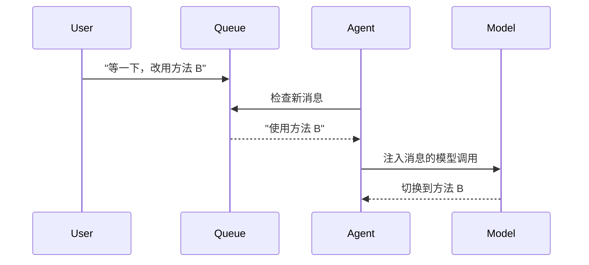

**创新**: 你可以在代理工作时向它发送消息，它将在下一步获取你的输入。

#### 3. open_pr_if_needed
**目的**: PR 创建的安全网

```python
# 概念：代理后钩子
if agent_finished and no_pr_created:
    # 代理忘记打开 PR — 自动执行
    commit_changes()
    open_draft_pr()
    notify_user("作为安全网打开了 PR")
```

**设计理念**: Stripe 确定性节点的轻量级版本——确保关键步骤发生，无论 LLM 行为如何。

### 子代理生成

**`task` 工具**支持并行子代理委托：

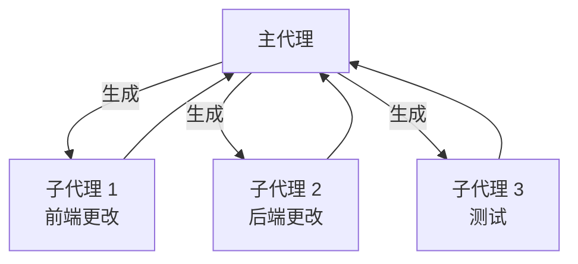

**每个子代理都有**：
- 自己的中间件栈
- 独立的待办列表
- 隔离的文件操作
- 单独的沙箱（如果需要）

**用例**: 在独立的子任务上并行工作（例如，前端 + 后端 + 测试）。

---

## 3. 端到端设计流程

### 从触发到 PR

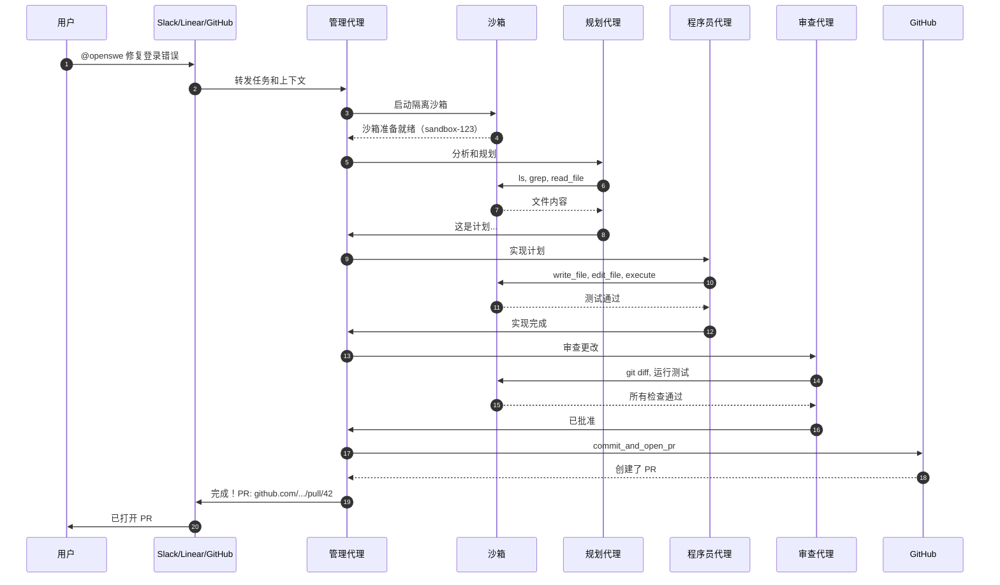

### 沙箱生命周期

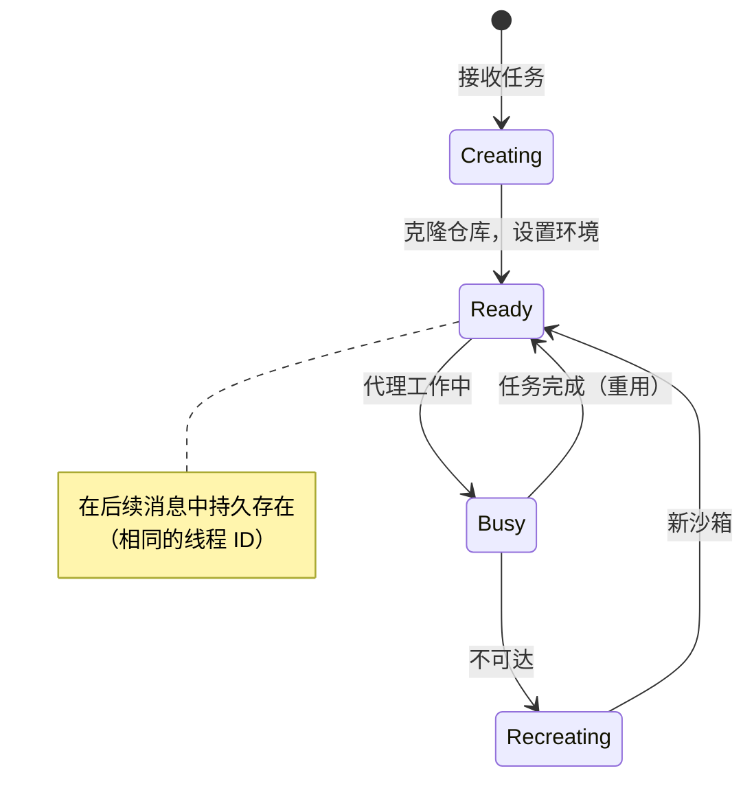

**沙箱提供商**：
- **Modal**: 无服务器容器
- **Daytona**: 长期存在的开发环境
- **Runloop**: AI 优化的沙箱
- **LangSmith**: 内置云沙箱
- **自定义**: 插入你自己的

### 线程到沙箱映射

每次调用创建**确定性线程 ID**：

```
Slack 线程: slack.com/archives/C1234/p5678
    ↓
线程 ID: slack_C1234_p5678
    ↓
沙箱: sandbox-slack_C1234_p5678
```

**优势**：
- 后续消息路由到同一个沙箱
- 状态在对话中保持
- 多个任务并行运行（不同的沙箱）

---

## 4. 设计理念

Open SWE 的架构反映了深思熟虑的设计选择：

### 1. 组合，不分叉

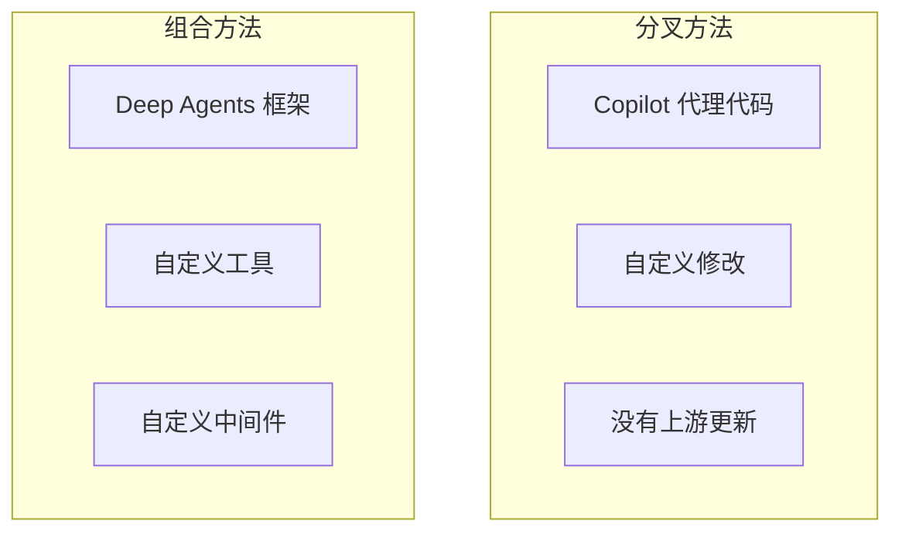

**决定**: 在 Deep Agents 上组合，而不是分叉现有的代理。

**优势**：
- **升级路径**: 吸收上游改进
- **可维护性**: 框架处理复杂的编排
- **可定制性**: 覆盖工具、中间件、提示

### 2. 沙箱优先的隔离

**原则**: *"首先隔离，然后在边界内给予完全权限。"*

```mermaid
flowchart LR
    subgraph "沙箱外"
        Prod[生产系统]
        Secrets[密钥/密钥]
    end

    subgraph "沙箱内"
        Code[仓库克隆]
        Shell[完全 Shell 访问]
        Tests[运行测试]
    end

    Prod --|无访问| Code
    Secrets --|无访问| Code
```

**理由**：
- **爆炸半径限制**: 错误不会影响生产
- **没有确认提示**: 代理可以自主工作
- **并行执行**: 多个任务同时运行

### 3. 工具精选而非累积

**Stripe 的见解**: 500 个精选工具 > 5000 个累积的工具。

**Open SWE 的方法**：
- 约 15 个核心工具
- 每个工具有单一、清晰的目的
- 工具是可组合的原语

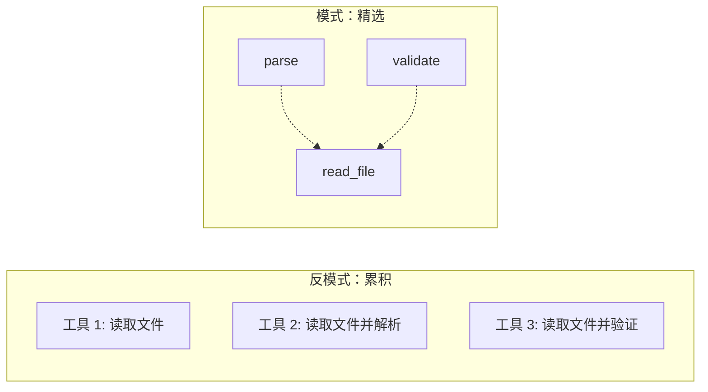

### 4. 先规划，再审查，最后发布

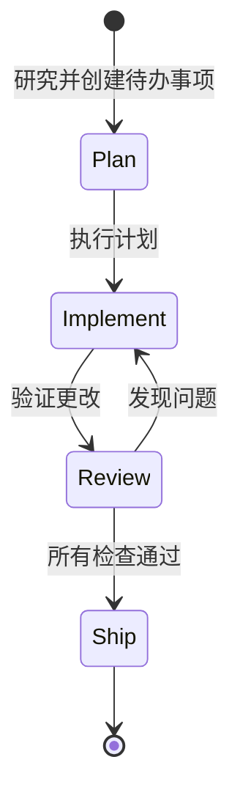

**理由**：
- **减少构建失败**: 规划早期捕获边界情况
- **更好的代码**: 审查代理在 PR 前捕获问题
- **更快迭代**: 快速失败，快速修复

---

## 5. 比较与创新

### 功能比较

| 功能 | Open SWE | Devin | SWE-agent | AutoCodeRover |
|---------|----------|-------|-----------|---------------|
| **开源** | ✅ MIT | ❌ 专有 | ✅ MIT | ✅ MIT |
| **框架** | LangGraph + Deep Agents | 专有 | 自定义 | 自定义 |
| **沙箱** | 可插拔（4+ 提供商） | 内置 | E2B | 自定义 |
| **多代理** | ✅（4 个专门代理） | ❓ 未知 | ❌ 单代理 | ❌ 单代理 |
| **Slack 集成** | ✅ 原生 | ❌ | ❌ | ❌ |
| **Linear 集成** | ✅ 原生 | ❌ | ❌ | ❌ |
| **子代理生成** | ✅ 原生 | ❓ | ❌ | ❌ |
| **任务中消息** | ✅ | ❓ | ❌ | ❌ |
| **AGENTS.md 支持** | ✅ | ❌ | ❌ | ❌ |

### 关键创新

1. **可插拔沙箱**: 不局限于一个提供商
2. **任务中消息**: 人类可以实时引导代理
3. **AGENTS.md 模式**: 仓库级别的约定编码
4. **可组合架构**: 构建在可重用的框架上
5. **多平台触发器**: Slack + Linear + GitHub

### 权衡

| 决定 | 优势 | 权衡 |
|----------|---------|-----------|
| **LangGraph 依赖** | 表达式编排 | 框架锁定 |
| **多代理系统** | 专门角色 | 更高延迟 |
| **沙箱隔离** | 安全的并行执行 | 更慢启动 |
| **AGENTS.md** | 仓库约定 | 需要文件维护 |

---

## 6. 未来扩展和用例

### 潜在增强

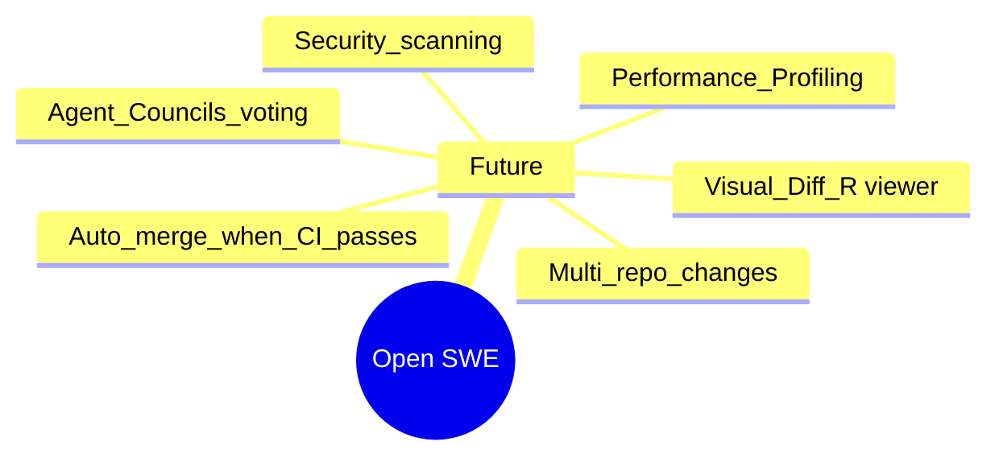

### 用户角色

| 角色 | 目标 | Open SWE 价值 |
|---------|------|----------------|
| **初创公司 CTO** | 构建内部工具 | 生产就绪的起点 |
| **企业开发者** | 为组织堆栈定制 | 可插拔架构 |
| **开源维护者** | 自动化 PR 分类 | GitHub 集成 |
| **工程经理** | 提高团队速度 | 自动化例行任务 |
| **研究员** | 研究代理架构 | 透明实现 |

### 用户旅程图

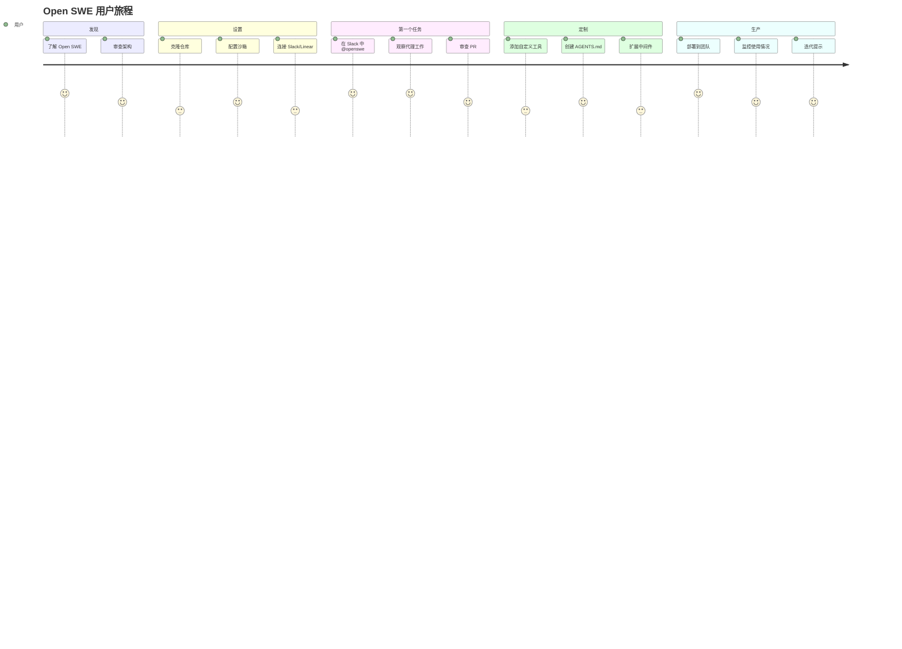

### 用例

1. **错误修复**: "修复用户服务中的空指针"
2. **功能实现**: "为仪表板添加深色模式"
3. **测试编写**: "为身份验证模块编写单元测试"
4. **文档**: "使用新示例更新 README"
5. **重构**: "将分页提取到共享工具中"
6. **依赖更新**: "升级 React 到 v19 并修复破坏性更改"

---

## 7. 技术实现亮点

### 代理创建（高级）

```python
# 概念：Open SWE 如何创建代理
from deep_agents import create_deep_agent

agent = create_deep_agent(
    model="anthropic:claude-opus-4-6",
    system_prompt=construct_system_prompt(repo_dir),
    tools=[
        http_request,
        fetch_url,
        commit_and_open_pr,
        linear_comment,
        slack_thread_reply,
    ],
    backend=sandbox_backend,
    middleware=[
        ToolErrorMiddleware(),
        check_message_queue_before_model,
    ],
)
```

### 沙箱后端（概念）

```python
# 概念：可插拔的沙箱后端
sandbox_backends = {
    "modal": ModalSandbox(),
    "daytona": DaytonaSandbox(),
    "runloop": RunloopSandbox(),
    "langsmith": LangSmithSandbox(),
}

# 根据环境变量选择
backend = sandbox_backends[os.getenv("SANDBOX_PROVIDER", "langsmith")]
```

### AGENTS.md 示例

```markdown
# AI 代理的仓库约定

## 代码风格
- Python: PEP 8，4 空格缩进
- JavaScript: 2 空格缩进，Prettier
- 提交 Python 文件前运行 `black .` 和 `isort .`

## 测试
- 所有函数都需要文档字符串
- 测试覆盖率必须超过 80%
- 提交前运行 `pytest`

## 架构
- 对服务使用依赖注入
- 数据库查询通过 `repository/` 层进行
- 没有循环导入

## Git 提交格式
- 格式：`[type] scope: description`
- 类型：feat、fix、docs、refactor、test
```

### 中间件链（概念）

```python
# 概念：中间件执行
async def run_agent_with_middleware(agent, input_data):
    for middleware in middleware_chain:
        input_data = await middleware.before_agent(input_data)

    result = await agent.run(input_data)

    for middleware in reversed(middleware_chain):
        result = await middleware.after_agent(result)

    return result
```

---

## 8. 经验教训

### 效果良好的方面

1. **LangGraph 编排**: 状态机方法防止无限循环并提供清晰的交接
2. **沙箱隔离**: 在隔离环境中并行执行完美运行
3. **AGENTS.md 模式**: 简单的约定编码强大且可维护
4. **工具精选**: 15 个专注的工具 > 100 个累积的工具
5. **任务中消息**: 启用实时人工引导

### 挑战

1. **框架依赖**: 锁定在 LangGraph 和 Deep Agents
2. **沙箱启动时间**: 冷启动增加延迟
3. **成本**: 为每个任务运行沙箱会增加成本
4. **上下文限制**: 大型代码库仍然需要仔细的内存管理

### 建议

1. **从简单开始**: 使用默认配置，逐渐定制
2. **编写 AGENTS.md**: 在约定编码上投入时间
3. **监控沙箱成本**: 设置预算和警报
4. **扩展中间件**: 在中间件链中添加特定于组织的验证
5. **贡献回馈**: 与社区分享有用的工具和中间件

---

## 9. 关键要点

:::info 核心见解
Open SWE 表明**内部编码代理**不需要是专有的。通过在 LangGraph 和 Deep Agents 上组合，团队可以构建与精英工程组织功能相当的生产级代理。
:::

:::tip 设计模式
**AGENTS.md 模式**是一种简单而强大的编码仓库约定的方法。它是 Stripe 的"规则文件"概念，为开源而改编。
:::

:::warning 权衡意识
多代理系统增加延迟。对于简单任务，单个代理可能更快。对于受益于专业化的复杂任务，使用多代理架构。
:::

### 进一步学习

- [LangGraph 文档](https://www.langchain.com/langgraph)
- [Deep Agents 概述](https://docs.langchain.com/oss/python/deepagents/overview)
- [Open SWE GitHub](https://github.com/langchain-ai/open-swe)
- [LangChain 博客：Open SWE](https://blog.langchain.com/open-swe-an-open-source-framework-for-internal-coding-agents/)

---

## 来源

- [LangChain Open SWE GitHub 仓库](https://github.com/langchain-ai/open-swe)
- [LangChain 博客：Open SWE 框架](https://blog.langchain.com/open-swe-an-open-source-framework-for-internal-coding-agents/)
- [LangChain 博客：介绍 Open SWE](https://blog.langchain.com/introducing-open-swe-an-open-source-asynchronous-coding-agent/)
- [Deep Agents 文档](https://docs.langchain.com/oss/python/deepagents/overview)
- [LangGraph 官网](https://www.langchain.com/langgraph)
- [Medium：Open SWE 深度指南](https://medium.com/data-science-in-your-pocket/langchain-open-swe-in-depth-guide-to-the-open-source-asynchronous-coding-agent-3957c49153e9)