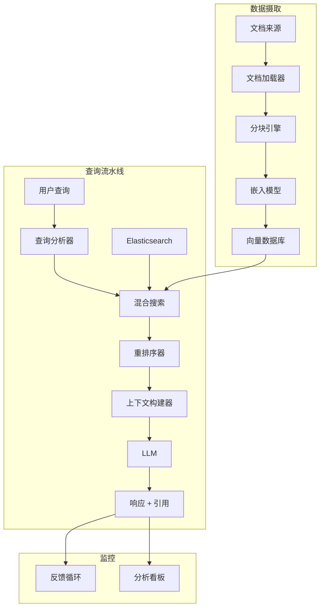
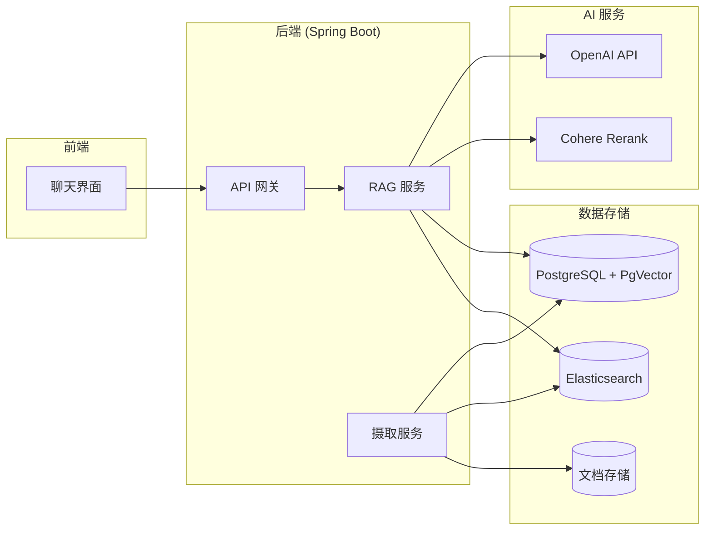

# 📚 企业级 RAG 知识库

> **构建一个在生产环境中真正可用的 AI 驱动内部知识库。**

---

## 1. 问题陈述

### 业务背景
团队在多个系统中积累了数千份内部文档（Confluence 页面、PDF、技术规格、运维手册）。工程师们花费大量时间搜索信息，往往直接询问同事。

### 需求
- **自然语言搜索** - 用自然语言提问
- **来源归因** - 每个回答必须引用其来源
- **多格式支持** - PDF、Markdown、HTML、Word 文档
- **访问控制** - 遵循现有权限体系
- **低延迟** - 3 秒内返回响应

### 成功标准
- Top-3 检索结果 90%+ 相关度
- 80%+ 用户满意度
- 信息查找时间减少 50%

---

## 2. 研究与分析

### 方案对比

| 方案 | 优势 | 劣势 |
|----------|------|------|
| **传统搜索 (Elasticsearch)** | 成熟、快速 | 语义理解能力差 |
| **微调 LLM** | 最佳准确率 | 成本高、容易过时 |
| **RAG（检索 + 生成）** | 内容实时、可溯源 | 流水线复杂 |
| **混合方案 (ES + RAG)** | 兼具两者优势 | 复杂度最高 |

### 概念验证结果

我们用 500 份文档进行了测试：

| 方法 | MRR@5 | 用户偏好 |
|--------|-------|-----------------|
| Elasticsearch | 0.62 | 25% |
| 纯向量搜索 | 0.71 | 45% |
| 混合搜索 + 重排序 | 0.89 | 75% |

**决策**：混合搜索加重排序提供了精确率和召回率的最佳平衡。

---

## 3. 架构设计

### 高层架构



### 组件拆解

| 组件 | 技术选型 | 用途 |
|-----------|------------|---------|
| **文档加载器** | Apache Tika | 解析多种格式 |
| **分块器** | 自定义（递归） | 智能文档切分 |
| **嵌入模型** | OpenAI text-embedding-3-small | 向量表示 |
| **向量数据库** | PgVector (PostgreSQL) | 相似度搜索 |
| **重排序器** | Cohere Rerank | 精度提升 |
| **LLM** | GPT-4o | 答案生成 |
| **后端** | Spring Boot 3 | 编排协调 |

---

## 4. 实现要点

### 智能分块策略

简单的固定大小分块会破坏文档上下文。我们实现了层次化方法：

```java
public class SmartChunker {

    public List<Chunk> chunk(Document doc) {
        // 1. 检测文档结构
        DocumentStructure structure = parseStructure(doc);

        // 2. 先按语义章节拆分
        List<Section> sections = structure.getSections();

        // 3. 对大章节进行带重叠的进一步拆分
        List<Chunk> chunks = new ArrayList<>();
        for (Section section : sections) {
            if (section.tokenCount() > MAX_CHUNK_TOKENS) {
                chunks.addAll(splitWithOverlap(section, 512, 50));
            } else {
                chunks.add(new Chunk(section.content(), section.metadata()));
            }
        }

        // 4. 用父级上下文丰富分块
        return enrichWithContext(chunks, structure);
    }

    private Chunk enrichWithContext(Chunk chunk, DocumentStructure structure) {
        // 添加章节标题和文档标题作为上下文
        String enrichedContent = String.format(
            "Document: %s\nSection: %s\n\n%s",
            structure.getTitle(),
            chunk.getSectionPath(),
            chunk.getContent()
        );
        return chunk.withContent(enrichedContent);
    }
}
```

### PDF 表格提取挑战

包含表格的 PDF 是一大痛点。OCR 和基于规则的解析效果不佳。

**解决方案**：多策略提取配合质量评分

```java
public TableExtractionResult extractTables(PdfDocument pdf) {
    List<TableExtractionStrategy> strategies = List.of(
        new CamelotStrategy(),      // 基于结构
        new TabulaStrategy(),       // 基于流
        new VisionLLMStrategy()     // GPT-4 Vision 备选方案
    );

    Map<Integer, TableResult> bestResults = new HashMap<>();

    for (int page = 0; page < pdf.getPageCount(); page++) {
        for (TableExtractionStrategy strategy : strategies) {
            TableResult result = strategy.extract(pdf.getPage(page));

            // 基于结构完整性评分
            double score = scoreTableQuality(result);

            if (score > bestResults.getOrDefault(page, TableResult.empty()).score()) {
                bestResults.put(page, result.withScore(score));
            }
        }
    }

    return new TableExtractionResult(bestResults);
}
```

### 混合搜索实现

```java
@Service
public class HybridSearchService {

    public List<SearchResult> search(String query, int topK) {
        // 1. 语义搜索（向量相似度）
        List<VectorResult> vectorResults = vectorStore
            .similaritySearch(query, topK * 2);

        // 2. 关键词搜索（Elasticsearch）
        List<ESResult> keywordResults = elasticsearch
            .search(query, topK * 2);

        // 3. 倒数排名融合
        Map<String, Double> fusedScores = reciprocalRankFusion(
            vectorResults, keywordResults, k = 60
        );

        // 4. 对 top 候选进行重排序
        List<String> candidates = fusedScores.entrySet().stream()
            .sorted(Map.Entry.comparingByValue().reversed())
            .limit(20)
            .map(Map.Entry::getKey)
            .toList();

        return reranker.rerank(query, candidates, topK);
    }

    private Map<String, Double> reciprocalRankFusion(
            List<VectorResult> vector,
            List<ESResult> keyword,
            int k) {
        Map<String, Double> scores = new HashMap<>();

        // RRF 公式：score = Σ 1/(k + rank)
        for (int i = 0; i < vector.size(); i++) {
            String docId = vector.get(i).id();
            scores.merge(docId, 1.0 / (k + i + 1), Double::sum);
        }

        for (int i = 0; i < keyword.size(); i++) {
            String docId = keyword.get(i).id();
            scores.merge(docId, 1.0 / (k + i + 1), Double::sum);
        }

        return scores;
    }
}
```

---

## 5. 挑战与解决方案

### 挑战 1：摄取流水线速度慢

**问题**：处理 10,000 份文档需要 8 小时以上。

**尝试方案**：
1. 线程池并行化 → OOM 错误
2. 增大批处理大小 → 触发 API 速率限制

**解决方案**：
- 生产者-消费者模式配合有界队列
- 背压处理
- 增量处理（仅处理变更的文档）

**结果**：10,000 份文档 45 分钟完成

### 挑战 2：幻觉引用

**问题**：LLM 会引用不包含相关信息的来源。

**解决方案**：
1. 在提示中内联包含源内容
2. 后处理验证引用是否存在于检索到的分块中
3. 添加置信度评分

```java
public VerifiedAnswer verifyAnswer(String answer, List<Chunk> sources) {
    List<Citation> verifiedCitations = new ArrayList<>();

    for (Citation citation : parseCitations(answer)) {
        // 查找源分块
        Optional<Chunk> sourceChunk = findChunk(citation.sourceId(), sources);

        if (sourceChunk.isPresent()) {
            // 验证声明是否出现在来源中
            double similarity = semanticSimilarity(
                citation.claim(),
                sourceChunk.get().content()
            );

            if (similarity > 0.75) {
                verifiedCitations.add(citation.withVerified(true));
            } else {
                verifiedCitations.add(citation.withVerified(false));
            }
        }
    }

    return new VerifiedAnswer(answer, verifiedCitations);
}
```

---

## 6. 结果与指标

### 性能提升

| 指标 | 优化前 | 优化后 | 提升 |
|--------|--------|-------|-------------|
| **MRR@5** | 0.62 | 0.91 | +47% |
| **搜索时间 (p95)** | 无 | 2.1s | 达标 |
| **用户满意度** | 无 | 87% | 超出目标 |
| **信息查找时间** | ~15 分钟 | ~2 分钟 | -87% |

### 使用统计（首月）

- 处理 2,500+ 次查询
- 150 个活跃用户
- 95% 回答率（5% "未找到"）
- 平均每会话 3.2 个追问

---

## 7. 经验教训

### 做得好的方面
- ✅ 混合搜索显著优于单一方法
- ✅ 用户反馈循环使快速迭代成为可能
- ✅ 带上下文的分块提升了检索质量

### 可以改进的方面
- ⚠️ 一开始架构过于复杂 - 应该先验证简单方案
- ⚠️ 低估了文档解析的难度
- ⚠️ 应该从第一天就做好监控

### 建议

1. **从评估开始** - 先构建测试集再构建系统
2. **分块质量 > 数量** - 更少但结构良好的分块效果更好
3. **投资可观测性** - LangSmith 或类似工具用于调试
4. **为反馈做好准备** - 用户会发现你没预料到的边界情况

---

## 架构图



---

:::info 核心要点
RAG 系统需要关注整个流水线——从文档摄取到响应生成。检索质量往往比生成模型的选择更重要。
:::
